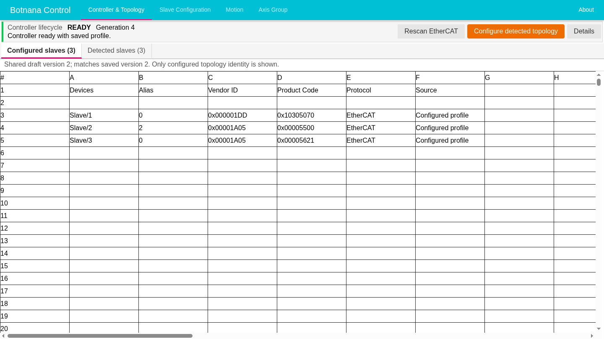
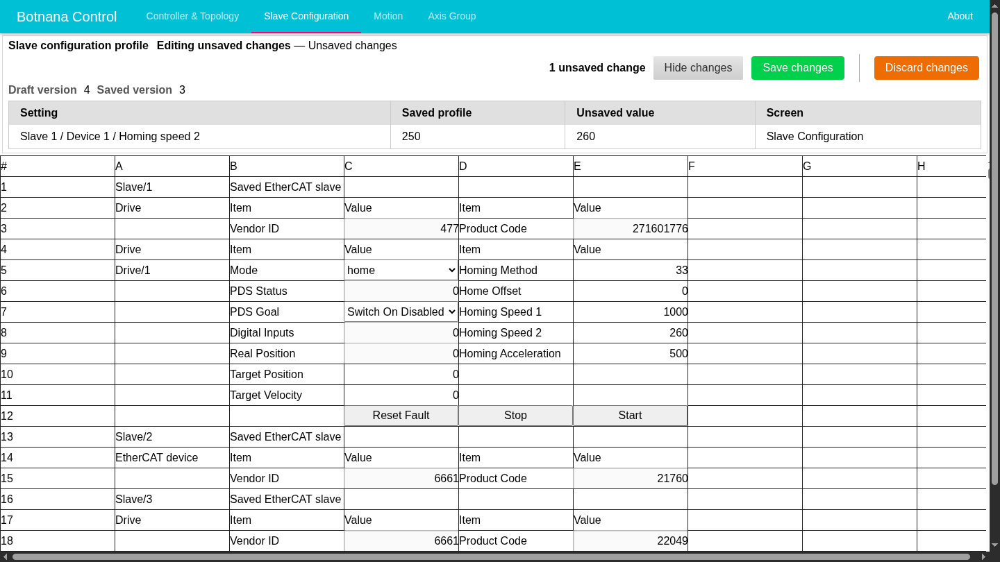
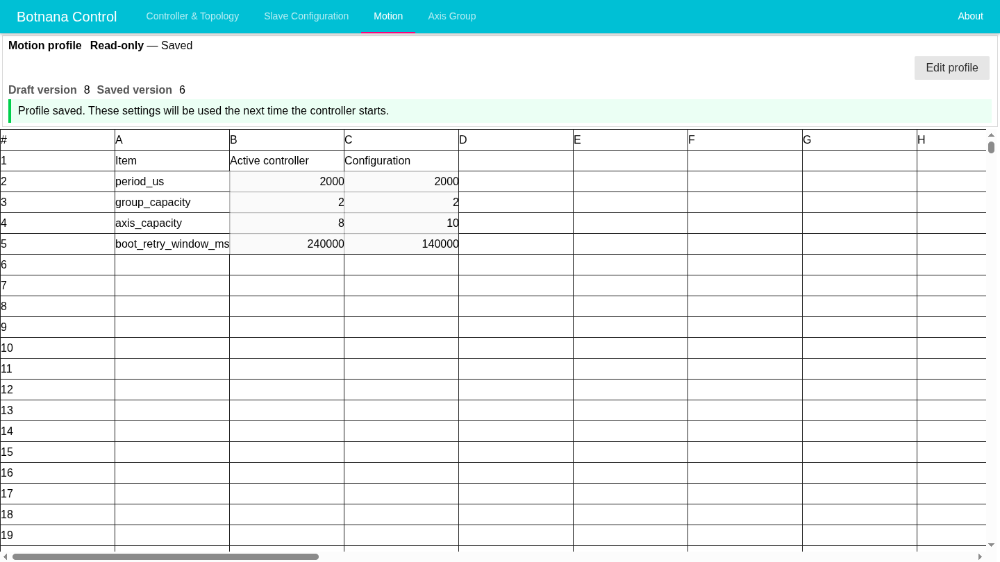
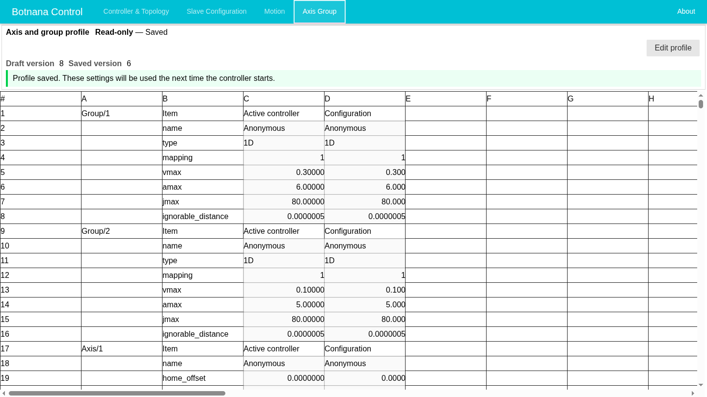

## Getting Started with Botnana Control

By default, the Botnana BN-B3A starts Mapacode's Botnana Control point-to-point
axis-control software automatically at boot.

### Open the HMI

Connect the host computer to the BN-B3A control network. Then open
[http://192.168.7.2:3000](http://192.168.7.2:3000) in a browser. If the
controller uses a different configured address, open that address instead.

Wait for the HMI to connect and show the current controller lifecycle. Do not
assume that opening the page means the EtherCAT controller is ready. The example
below shows a **Ready** controller in the **Controller & Topology** work area.

### Choose a Work Area

Use the primary navigation across the top of the HMI. Selecting a work area does
not by itself change the saved profile or running controller.

| Navigation item | Purpose |
|---|---|
| **Controller & Topology** | Check controller lifecycle and startup progress; compare configured, detected, and proposed EtherCAT topology; start a normal rescan, recovery, or guided topology review when appropriate. |
| **Slave Configuration** | Review configured EtherCAT slave identities; edit supported drive, I/O, channel, and device-specific profile settings. Runtime controls are available only when the controller state permits them. |
| **Motion** | Review or edit motion-wide settings such as cycle period, axis and group capacities, and the EtherCAT startup retry window. |
| **Axis Group** | Review or edit axis settings, drive and encoder assignments, and axis-group mappings and limits. |
| **About** | Review the Botnana Control version and current IP address; manage approved software updates, IP-address changes, reboot, and power-off operations. |

**Slave Configuration**, **Motion**, and **Axis Group** are different views of
the same shared profile draft. Finish the current edit by saving or discarding
it before starting another exclusive configuration or maintenance operation.

### Review and Edit Slave Configuration

Open **Slave Configuration** to inspect the saved EtherCAT slaves and their
supported device settings. This work area shows the saved profile, not a new
physical scan. Use the [topology review workflow](./ethercat-topology-maintenance.md)
when the physical order, identity, or alias must change.

Rows in this work area can have different effects:

| Row kind | Examples | Behavior |
|---|---|---|
| Saved identity | Slave position, description, vendor ID, and product code | Identifies the slave in the saved profile. Vendor ID and product code remain read-only, including in profile-editing mode. Review physical identity or alias changes through the topology workflow. |
| Profile setting | Homing method, offsets, speeds, acceleration, and supported I/O or channel settings | Editable only in profile-editing mode. A confirmed edit changes the shared draft, not the running controller. |
| Live status | PDS status, digital inputs, real position, and device status counters | Read-only observations from the running controller. |
| Live control | Operation mode, PDS goal, target values, **Reset Fault**, **Stop**, and **Start** | Acts on the running controller when available. It is not a saved-profile edit. |

> **Warning:** **Read-only** and **Editing** in the page header describe the
> saved profile. They do not make the machine safe and do not turn live controls
> into profile settings. Use live controls only after **Controller & Topology**
> reports **Ready**, with the machine in the site-approved safe condition.

To edit the saved slave profile:

1. Use one browser session as the active profile editor. Coordinate with other
   HMI users and confirm that the displayed saved slaves are the intended
   configuration.
2. Select **Edit profile**. Editable profile cells become available; live status
   and live controls retain their separate meanings.
3. Change the required profile cell and wait for the HMI to show the new draft
   version and unsaved-change count.
4. Select **Review changes**. Check the setting, saved value, unsaved value, and
   owning screen for every row.

   

5. Choose one action:
   - **Save changes** saves the entire shared draft for the next controller
     start. It does not replace settings in the running controller.
   - **Discard changes** discards the entire shared draft and restores the saved
     profile.
6. When no unsaved changes remain, select **Finish editing** to return to
   read-only mode. **Finish editing** does not save anything.

Save and discard apply to the shared draft, not only to rows visible on
**Slave Configuration**. If **Review changes** lists work from another screen,
coordinate with its owner before proceeding. If an edit or save reports that
the profile changed in another session, review the refreshed values instead of
repeating the action blindly.

### Review and Edit Motion Settings

Open **Motion** to compare the motion-wide values used by the running controller
with the shared profile configuration.

The two value columns have different lifecycles:

- **Active controller** shows the value selected when the current controller
  generation started. Saving a profile does not change this column.
- **Configuration** shows the saved profile in read-only mode and the shared
  draft while editing. The screenshot deliberately shows saved values that
  differ from the active controller. These are example values, not defaults.

The Motion rows have these effects:

| Setting | Meaning |
|---|---|
| `period_us` | Real-time motion cycle in microseconds. A shorter period increases the required processing rate. |
| `group_capacity` | Number of axis-group profiles available under **Axis Group**. |
| `axis_capacity` | Number of axis profiles available under **Axis Group** and the upper bound for group mappings. |
| `boot_retry_window_ms` | Time in milliseconds available for retrying acquisition of a usable EtherCAT master during controller startup. It is not the complete readiness deadline. |

Use the same **Edit profile**, **Review changes**, **Save changes**, and
**Discard changes** workflow described for Slave Configuration. Do not start a
second editing session or save only part of the shared draft.

> **Important:** Saving Motion settings prepares them for a later controller
> start; it does not apply them to the running controller. A normal **Rescan
> EtherCAT** uses the last-working settings rather than newly saved profile
> values. Plan any controlled restart under the site's commissioning procedure,
> then verify **Ready** and the **Active controller** readback before enabling
> motion.

### Review and Edit Axis and Group Settings

Open **Axis Group** to compare active axis and group values with their profile
configuration. The capacities configured under **Motion** determine how many
`Group/N` and `Axis/N` sections this work area displays.

The work area organizes settings by responsibility:

| Section | Settings |
|---|---|
| Group identity | `name` and `type`; supported group types include `1D`, `2D`, `3D`, and `SINE`. |
| Group mapping | `mapping` lists the one-based axis numbers coordinated by the group. Its length must match the group type. |
| Group limits | `vmax`, `amax`, `jmax`, and `ignorable_distance` define group-level command and completion limits in the configured engineering units. |
| Axis feedback | Home offset, encoder scale and direction, optional external-encoder settings, and closed-loop settings. |
| Axis limits and tuning | Axis velocity and acceleration limits, ignorable distance, position-deviation limit, and feed-forward values. |
| Device assignment | Drive and external-encoder alias, slave position, and channel. These assignments refer to the saved topology; they do not change EtherCAT vendor or product identity. |

Axis and group edits use the same shared profile workflow; review the owning
**Screen** shown for every pending change before saving. When changing Motion
capacities and Axis Group rows in one draft, recheck every mapping against the
configured axis count.

> **Warning:** Incorrect scaling, direction, mapping, limits, or device
> assignment can command unintended motion or invalidate feedback. Commission
> these changes with motion disabled and the machine in the site-approved safe
> condition. After the controlled controller start, verify assignments,
> direction, scaling, and limits before enabling motion.

### Keep Observation, Configuration, and Operation Separate

The HMI deliberately keeps these states separate:

- **Detected hardware** is read-only evidence from the latest complete physical
  EtherCAT scan. A scan does not save or adopt it.
- The **shared draft** contains the configuration currently being reviewed in
  the profile work areas. Unsaved draft changes are not durable.
- The **saved profile** is the durable configuration stored on the controller.
- The **running controller** uses the settings from its successful startup.
  Saving a profile does not silently replace those active settings.

A normal **Rescan EtherCAT** rebuilds from **Last working settings**, not from
unsaved edits. When the controller is unavailable, **Start controller** uses the
reviewed saved profile. An approved physical topology change uses its dedicated
review and **Approve, save, and start** workflow.

Wait until **Controller & Topology** reports **Ready** before using motion or
live EtherCAT controls. Keep the machine in the site-approved safe condition
while the controller is unavailable, starting, or reporting a failure; HMI
commands are maintenance controls, not safety interlocks.

### Continue with the Appropriate Procedure

- If **Controller & Topology** reports **Controller unavailable**, or a normal
  rescan is required, follow
  [EtherCAT Controller Recovery](./ethercat-controller-recovery.md).
- For an approved physical addition, removal, replacement, or reorder, follow
  [Review and Configure the EtherCAT Topology](./ethercat-topology-maintenance.md).
- For package installation or rollback, use
  [Software Updates](./update-software.md).
- For controller IP-address changes, use
  [USB Connection IP Settings](./faq/gadget.md).
- For settings that are maintained outside the HMI, see
  [Configuration File](./configuration-file.md).
