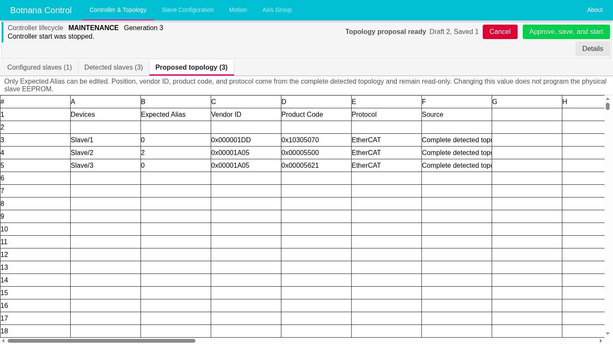

# Review and Configure the EtherCAT Topology

Use the guided topology review when an authorized commissioning technician deliberately
adds, removes, replaces, or reorders EtherCAT slaves. Use a normal **Rescan
EtherCAT** when the hardware layout is not meant to change. Use
[EtherCAT Controller Recovery](ethercat-controller-recovery.md) when a failure
was not caused by an approved layout change.

Scanning connected hardware does not save or adopt it. A changed layout becomes
active only after you use the complete scan as a proposal, review its
consequences, save it, start from that exact saved version, and reach **Ready**.

> **Safety:** Follow the site's lockout, motion-disable, electrical-isolation,
> and verification procedures. The HMI confirmation records your assertion that
> the machine is safe; it is not a safety interlock. Keep the machine in its
> approved safe condition while the controller is unavailable, starting, or
> reporting a failure.

## Understand the Topology States

**Controller & Topology** keeps physical observations, proposed edits, stored
configuration, and the running controller separate:

| HMI state | Meaning |
|---|---|
| **Configured slaves** | Read-only topology used as the saved comparison baseline during review. |
| **Detected slaves** | Read-only hardware from the latest successful fresh scan. During normal startup or rescan, it follows each latest complete physical startup scan. |
| **Proposed topology** | The complete fresh scan automatically proposed after **Configure detected topology**. Only **Expected Alias** is editable here. |
| **Shared draft** and **Draft version** | The configuration being reviewed. It is not yet stored for startup. |
| **Saved profile** and **Saved version** | The durable configuration stored on the controller. |
| **Running controller** | The configuration currently controlling the machine. Saving does not change it. |
| **Previous controller settings** | The exact retained controller plan restored when the review is cancelled. |

The sheet counts are cross-checks. A difference between configured and detected
counts changes nothing by itself. During review, the previous detected rows are
labelled **Before configuration** and **Reference only** until the fresh scan replaces
them.

Use **Slave Configuration** to review drive, I/O, channel, and other device-type
settings. Changing sheets in **Controller & Topology** does not replace that
editor.

## Prepare the Change

Before starting topology review:

1. Record the approved physical change, current slave order, aliases, vendor
   IDs, product codes, and rollback plan. Photograph labels and cabling when
   useful.
2. Confirm that the rollback plan from step 1 is practical: if the changed
   topology does not reach **Ready**, the previous slaves, physical order, and
   cabling can be restored.
3. On **Controller & Topology**, compare **Configured slaves** and **Detected
   slaves**.
4. Topology review uses the saved profile as its comparison and recovery
   baseline. Save existing edits that must be retained, or discard unwanted
   edits, until the HMI no longer reports **Unsaved changes**. This prevents
   ordinary configuration edits from being mixed with the topology change.
5. Stop scripts, recipes, HMI jobs, and other work using the controller.
6. Put the machine in the site-approved safe condition, isolate device power as
   required, perform the approved physical change, check cabling and order, and
   restore power only when permitted.
7. Continue only when **Configure detected topology** is available and no nearby
   message reports an unresolved condition.

The controller may be **Ready**, or it may be **Failed** because the deliberate
physical layout already differs from the clean saved profile. In this example,
the clean saved baseline contains one slave before two approved slaves are
added:

## Start the Guided Configuration

1. Select **Configure detected topology**.
2. Read the confirmation and confirm only if the machine is already safe.
3. Wait while Botnana Control releases the controller generation and EtherCAT
   master, performs a fresh scan, and creates the complete proposal. Do not
   repeat the request.
4. While the fresh scan is pending, **Detected slaves** keeps the previous rows
   under **Before configuration** and **Reference only** labels.
5. Confirm that **Proposed topology** opens automatically with the exact fresh
   scan. There is no separate review or refresh action.

The controller being unavailable is expected. Starting review does not change
the draft or saved version. Normal profile editors remain visible but are
disabled while the detected topology is being reviewed.

The resulting proposal below contains the complete three-slave scan. The tab
counts keep the configured, detected, and proposed sources visible, while the
proposal exposes only **Expected Alias** for editing:

If entry is rejected, read the displayed reason. Do not bypass it. Causes can
include unfinished controller work, an active transition, unsaved profile
edits, another exclusive topology operation, or runtime resources that cannot
safely be released.

## Inspect and Edit the Complete Proposal

1. Confirm every proposed position, vendor ID, and product code is intended.
   Partial adoption is not available.
2. If required, edit **Expected Alias** directly in the spreadsheet using a whole
   number from 0 through 65535. This may rebase references; it does not write the
   physical slave EEPROM.
3. Review every displayed cleared, defaulted, moved, retained, and alias
   consequence.
4. Confirm that the only action buttons are **Cancel** and **Approve, save, and
   start**.

If any row or consequence is unacceptable, select **Cancel**, correct the
hardware or plan, and begin again with **Configure detected topology**.

Typical consequences include:

| Change | Required review |
|---|---|
| Added slave | A minimal entry is created; Botnana Control does not guess device settings or mappings. |
| Removed slave | Review every drive, axis, group, I/O, or channel relationship that referred to it. |
| Unique move | Identity-bound references may move, but position-dependent assumptions still require review. |
| Unlike replacement | Device-specific settings are cleared rather than copied to different hardware. |
| Ambiguous identical devices | Botnana Control does not guess a move; unmatched settings are conservatively cleared. |

Do not accept a cleared or default value merely to enable saving. If a
consequence is not intended, cancel, correct the hardware or plan, scan again,
or cancel and discard the draft.

Removing the final slave can produce a valid zero-row proposal. An empty saved
slave list is treated as an uncommissioned topology; it does not enforce that no
slave may be connected later.

## Approve, Save, and Start

1. Select **Approve, save, and start**.
2. Confirm the exact proposed topology, expected aliases, and displayed
   consequences.
3. The proposal tab and both decision buttons close immediately. One exact
   approval request transfers the accepted consequences, durable save, and
   controller start to Botnana Control. The server completes that sequence
   without follow-up browser requests, so reconnecting or closing this browser
   after acceptance does not interrupt it. Intermediate proposal and save
   acknowledgements are not shown.
4. Continue only when the controller reports **Ready**.
5. Verify slave order, identity, required device settings, and machine state
   before restoring motion permission.

After successful approval and startup, the configured sheet shows the exact
saved three-slave topology and the controller reports **Ready**:

While the saved or previous controller is starting, the normal controller lifecycle is
the only progress display. If **Stop waiting** appears and you confirm it, the
attempt is cancelled, the internal review session ends, and the HMI returns to
the ordinary unavailable-controller state. It does not reopen topology review or
show retry/restore actions automatically. Deliberately choose
**Configure detected topology**, **Start controller**, or profile correction from
the current state.

## Cancel Without Adopting the Proposal

Select **Cancel** when the proposed hardware must not be activated. Confirm that
the unapproved draft will be discarded and the previous controller restored.
**Configured slaves** immediately returns to the saved-profile rows; proposal rows
must not remain there after cancellation. Cancellation does not change the saved
profile or adopt the proposal. Restore compatible physical hardware first when necessary,
then wait for **Ready** and verify the machine.

## Reconnection and Failures

The internal topology-review session belongs to the controller, not to one browser. After a
reload or reconnection, wait for **Restoring topology configuration state** to be
replaced by a current phase. Verify the phase, state revision, draft and saved
versions, detected snapshot, proposal, and reviews before continuing. If another
session acted first, review the refreshed state rather than repeating an old
request.

- **Scan failure:** Do not use an older snapshot when it is marked non-current.
  Select **Cancel**, correct power, links, cabling, or discovery state, then begin
  again with **Configure detected topology**.
- **Approval failure before save:** The proposal remains unapproved. Correct the
  problem, then approve again or cancel.
- **Start failure after save:** Topology configuration ends and the proposal does
  not reopen. The approved profile remains saved. Use the ordinary Controller
  unavailable workflow and **Start controller** when recovery permits it.
- **Service recovery is required:** Do not start another in-process operation.
  Record the phase, versions, generation, and error. Have an authorized
  administrator follow the `bnc-motion` procedure in
  [EtherCAT Controller Recovery](ethercat-controller-recovery.md#when-cleanup-fails).

For support, record the installed Botnana Control version, approved change,
physical identities and order before and after, review phase, draft and
saved versions, detected snapshot, accepted consequences, final controller
state, and the time of any disconnect, retry, or service restart.
