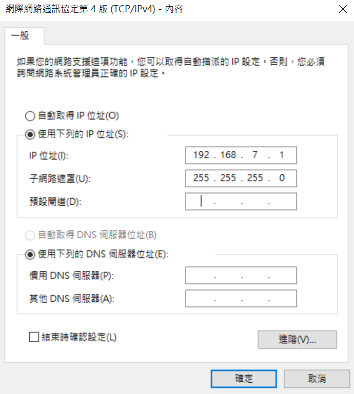
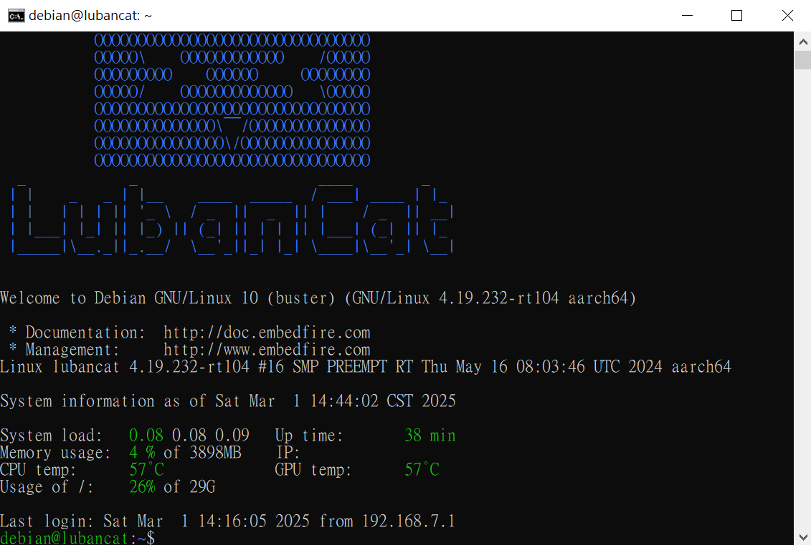
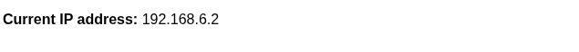
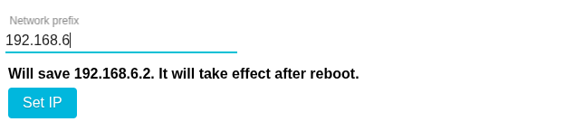

## USB Connection IP Settings

A new BN-B3A uses IP address `192.168.7.2`. Set the host computer to `192.168.7.1` with subnet mask `255.255.255.0`, as shown below.

1. Open **Settings > Network & Internet**, then select the option to change adapter settings.

    

1. Select the unidentified Ethernet network for the Remote NDIS or RNDIS adapter.

    

1. Open the network adapter's properties.

    

1. Select Internet Protocol Version 4 (TCP/IPv4).

    

1. Set the IP address and subnet mask.

    

1. Test connectivity using Command Prompt or PowerShell.

    

1. Run `ssh debian@192.168.7.2` to log in as `debian`. When asked whether to continue connecting, enter `yes`.

    

1. When prompted for a password, enter `temppwd`.

    

1. The following image shows the built-in Linux system.

    

1. You can also connect in a browser at [http://192.168.7.2:3000](http://192.168.7.2:3000). The BN-B3A does not currently support HTTPS, so the browser may display a security warning that can be ignored for this local connection.

    

### Update the Controller IP Address

1. Put the machine in a safe stopped condition and select **ABOUT**.
2. Wait for **Current IP address** to display the saved controller address. Record both the old address and the intended new address before continuing.

   

3. Under **Network prefix**, enter the first three numbers of the new network. The controller address always ends in `.2`. For example, enter `192.168.6` to save `192.168.6.2`.
4. Verify the preview names the exact intended address.

   

5. Select **Set IP**. Wait for **IP address saved. It will change after reboot.**

   

6. If **Set IP** is unavailable, wait for configuration protocol version 2 to be selected and the saved profile to load. Save or discard any unsaved machine-profile changes before trying again.
7. Select **REBOOT**. The saved address does not become active until the reboot.
8. Reconfigure the host computer for the new network, such as `192.168.6.1`, and reconnect to the controller at the new address, such as `http://192.168.6.2:3000`.

### Connect multiple BN-B3A controllers on the same computer.

Modify as **setting the IP**, but each BN-B3A needs to be set to a different IP segment.

For example:
Set the first module to address 192.168.**6**.2, and the second module to address 192.168.**7**.2.

### If you forget to update the IP address that you modified, what should you do?

Botnana Control BN-B3A has HDMI and USB; connect a monitor and keyboard, and after powering on, you can log in with username debian and password temppwd. Once logged in, execute `ip a`. Refer to the diagram; the IP of usb0 is the configured IP, which is shown as 192.168.7.2 in the diagram.

