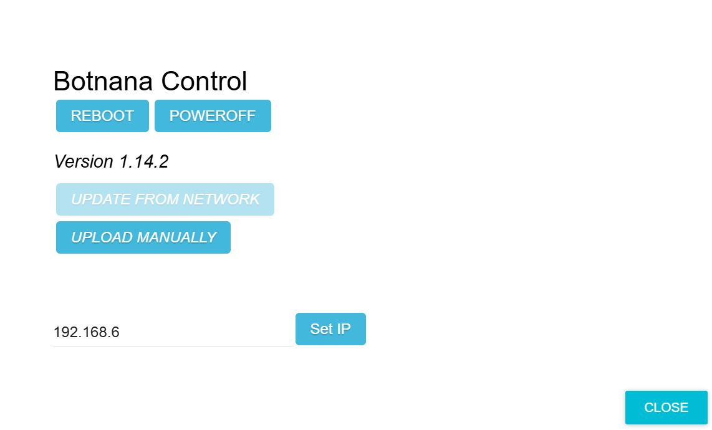

## USB Connection IP Settings

A new BN-B3A uses IP address `192.168.7.2`. Set the host computer to `192.168.7.1` with subnet mask `255.255.255.0`, as shown below.

1. Open **Settings > Network & Internet**, then select the option to change adapter settings.

    

1. Select the unidentified Ethernet network for the Remote NDIS or RNDIS adapter.

    

1. Open the network adapter's properties.

    

1. Select Internet Protocol Version 4 (TCP/IPv4).

    

1. Set the IP address and subnet mask.

    

1. Test connectivity using Command Prompt or PowerShell.

    

1. Run `ssh debian@192.168.7.2` to log in as `debian`. When asked whether to continue connecting, enter `yes`.

    

1. When prompted for a password, enter `temppwd`.

    

1. The following image shows the built-in Linux system.

    

1. You can also connect in a browser at [http://192.168.7.2:3000](http://192.168.7.2:3000). The BN-B3A does not currently support HTTPS, so the browser may display a security warning that can be ignored for this local connection.

    

### Update IP

If you need to modify the IP, such as to connect to two BN-B3A, or because it conflicts with other devices and you need to modify it, press the [ABOUT] button in the upper right corner, then in the input area to the left of [Set IP], enter the first three digits of the desired IP address. For example, to set the IP to 192.168.6.2, enter 192.168.6, as shown in the figure, then press [Set IP]. Note that after pressing [Set IP], a reboot is required. Additionally, you need to set the IP on the host computer to correspond, such as 192.168.6.1, to establish a connection.

### Connect multiple BN-B3A controllers on the same computer.

Modify as **setting the IP**, but each BN-B3A needs to be set to a different IP segment.

For example:
Set the first module to address 192.168.**6**.2, and the second module to address 192.168.**7**.2.

### If you forget to update the IP address that you modified, what should you do?

Botnana Control BN-B3A has HDMI and USB; connect a monitor and keyboard, and after powering on, you can log in with username debian and password temppwd. Once logged in, execute `ip a`. Refer to the diagram; the IP of usb0 is the configured IP, which is shown as 192.168.7.2 in the diagram.

