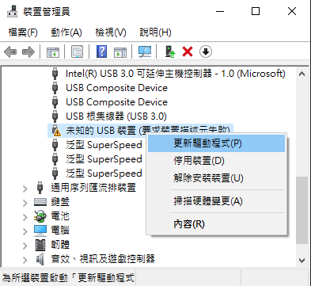
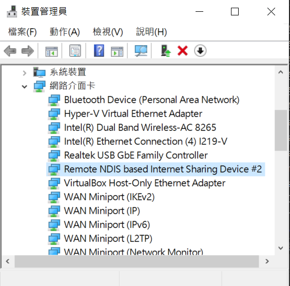
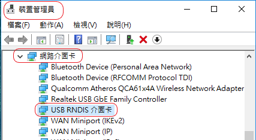
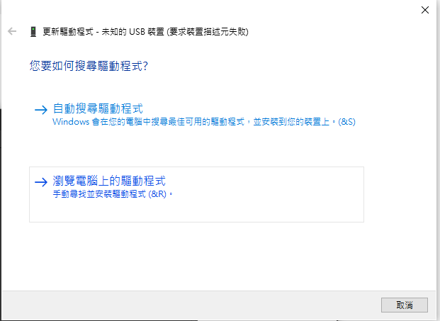
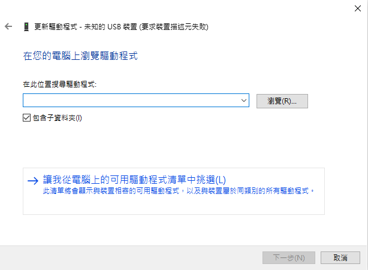
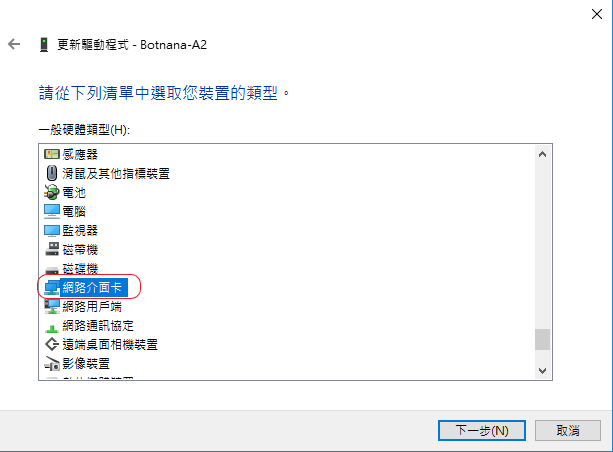
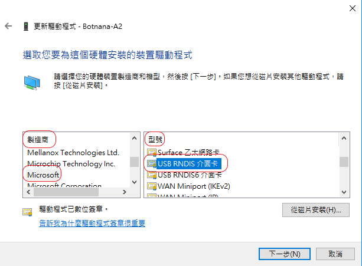
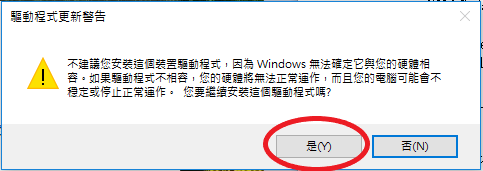
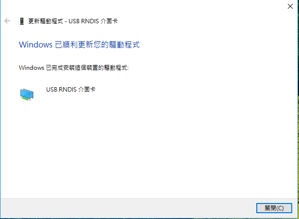

## Install the Windows 10 RNDIS Driver

Install the RNDIS driver before connecting a Botnana BN-B3A to Windows 10 through Type-C USB.

1. Connect the Botnana BN-B3A Type-C USB port to the computer.

1. If the following unknown device appears, uninstall it and then reinstall the RNDIS driver.

    

1. If a Remote NDIS or RNDIS device appears, the driver is installed. You may also choose to update it.

    

    Or:

    

1. When installing the driver, select **Browse my computer for drivers**.

    

1. Select **Let me pick from a list of available drivers on my computer**.

    

1. Select **Network adapters** as the hardware type.

    

1. Select **Microsoft** as the manufacturer and **USB RNDIS Adapter** as the model.

    

1. Dismiss the warning message.

    

1. Confirm that the driver update succeeds.

    

1. In Device Manager, check for **Network adapters > USB RNDIS Adapter / Remote NDIS Device**.

    

    Or:

    
