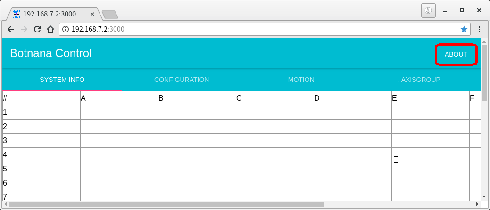
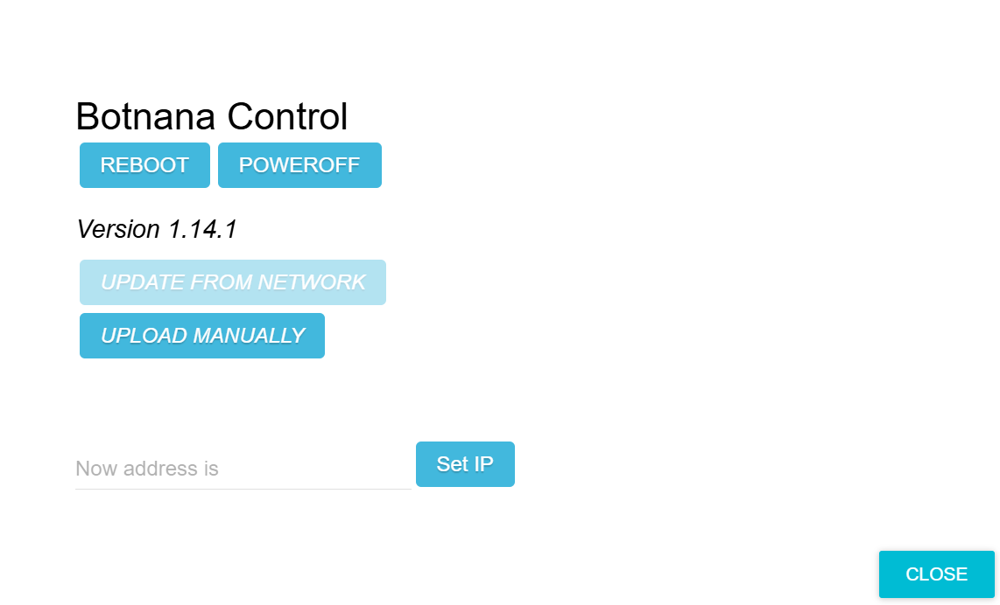
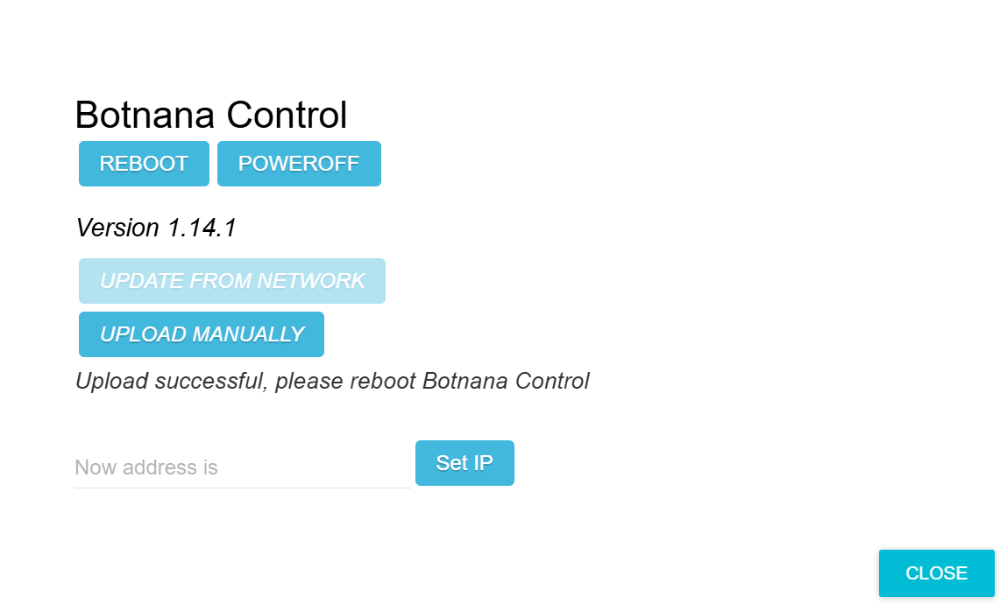
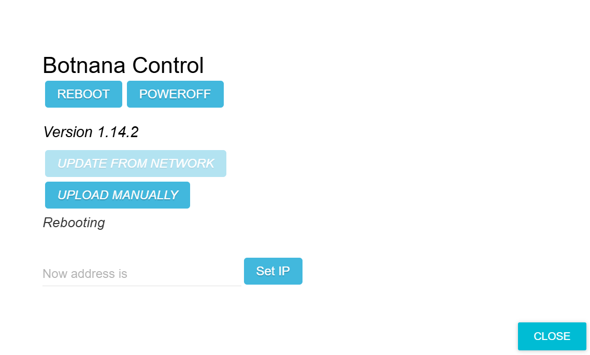

# Botnana Control Software Updates

Follow these steps when the master software must be updated for a new feature or bug fix.

## Obtain the Update File

Obtain the update file from Mapacode. The filename depends on the hardware platform:

| Platform | Update filename |
|----------|-----------------|
| BN-B3A | `botnana-control_*_arm64.deb` |

## Update Procedure

The following example updates a BN-B3A from Botnana Control 1.14.1 to 1.14.2 using `botnana-control_1.14.2-1_arm64.deb`.

1. Prepare a computer with a working network connection to Botnana Control. Google Chrome is recommended.
2. Open [http://192.168.7.2:3000](http://192.168.7.2:3000) in Chrome. `192.168.7.2` is the usual address; if your controller uses a different address, connect to that address instead.
3. On the Botnana Control home page, select **ABOUT** in the upper-right corner.

   

4. The **ABOUT** page displays the current version, 1.14.1 in this example. Select **UPLOAD MANUALLY**, browse to `botnana-control_1.14.2-1_arm64.deb`, and select the file.

   

5. Wait while the page displays `Uploading, Please wait`. When `Upload successful, please reboot Botnana` appears, select **REBOOT**.

   

6. The page displays `Rebooting` while the controller restarts and completes installation. A BN-B3A takes approximately three minutes. When installation finishes, the displayed version changes to 1.14.2.

   

7. The update is complete. Reload the browser page so that data cached when the connection opened is refreshed.
