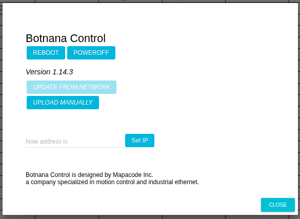
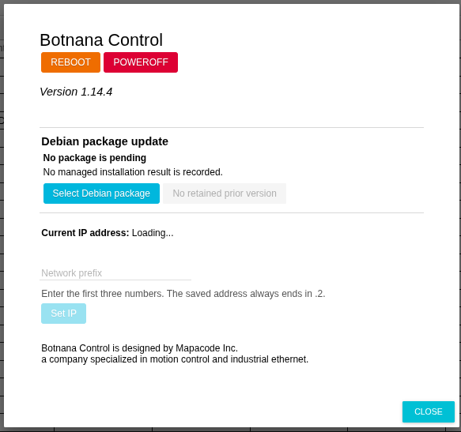

# Botnana Control Software Updates

Use the procedure that matches the **ABOUT** page currently displayed by the controller. Botnana Control 1.14.3 and earlier use the legacy upload page; version 1.14.4 and later use the reviewed Debian package update section.

## Before You Update

- Obtain the package from Mapacode or another trusted source. Do not install an unverified package received from an unknown source.
- Perform the update only from a trusted control network.
- Put the machine in a safe stopped condition. Updating and rebooting are maintenance actions, not safety functions.
- Keep power connected while the package is being installed.
- Record the current software version and controller IP address.

For a BN-B3A, the package filename has this form:

```text
botnana-control_<Debian-version>_arm64.deb
```

The corrected package for the 1.14.4 transition is:

```text
botnana-control_1.14.4-2_arm64.deb
```

The Debian package version is `1.14.4-2`; the product version displayed by Botnana Control is `1.14.4`.

## Upgrade Version 1.14.3 or Earlier

This is the one-time transition from the legacy updater to the package updater introduced in 1.14.4.

1. Prepare a computer with a working network connection to Botnana Control. Google Chrome is recommended.
2. Open the controller HMI, normally [http://192.168.7.2:3000](http://192.168.7.2:3000), and select **ABOUT**.
3. Confirm the old **ABOUT** page displays version 1.14.3 or earlier and provides **UPLOAD MANUALLY**.

   

4. Select **UPLOAD MANUALLY** and choose `botnana-control_1.14.4-2_arm64.deb`. Wait for the upload to finish. Do not close the page or remove power while it is uploading.
5. When **Upload successful, please reboot Botnana Control** appears, select **REBOOT**.

   

6. Allow approximately three minutes for a BN-B3A to reboot and install the package. Do not remove power during this period.
7. Reconnect to the HMI, reopen **ABOUT**, and verify that it displays **Version 1.14.4**.

   

8. Reload the browser page before returning the machine to operation.

After this one-time legacy upgrade, **No managed installation result is recorded** and **No retained prior version** may be displayed. This is expected: the legacy updater performed the installation before the 1.14.4 package manager became active. It does not mean that installation failed.

## Update Version 1.14.4 or Later

Version 1.14.4 and later use the **Debian package update** section on the **ABOUT** page.

1. Put the machine in a safe stopped condition and open **ABOUT**.
2. Select **Select Debian package** and choose the supplied `.deb` file.
3. Review all displayed facts before confirming:
   - original filename;
   - package identity (`botnana-control`);
   - Debian version;
   - architecture (`arm64` for BN-B3A);
   - classification such as upgrade, reinstall, or downgrade; and
   - SHA-256 checksum.
4. Select **Stage package** only when every value matches the intended release. Staging records the exact reviewed package for one installation attempt at the next boot.
5. Confirm the page reports **Staged; reboot to apply**, then select **REBOOT**. Do not use power-off as a substitute for the installation reboot.
6. Wait for the controller to restart, reconnect, and reopen **ABOUT**.
7. Verify both the displayed product version and **Last result**.

| Last result | Meaning and action |
|---|---|
| **Succeeded** | The managed package was installed. Verify the displayed version before operating the machine. |
| **Rejected before installation** | The package did not pass revalidation and was not installed. Obtain and review the correct package. |
| **Installation failed**, **Timed out**, or **Interrupted** | Installation may be partial. Do not operate motion; stage a reviewed known-good Botnana Control package and reboot to recover. |
| **Bookkeeping failed** or **Unknown result** | Installation completion cannot be trusted. Keep the machine stopped and follow the same recovery procedure. |

A pending package can be cancelled before installation starts. Once the boot installation begins, it is an at-most-once attempt and cannot be cancelled or automatically retried.

## Retained Packages and Rollback

The page may offer **Review retained version**. This is an exact package archive retained from an earlier successful **managed** installation. It is not necessarily the software that was installed immediately before the current version if packages were changed by the legacy updater or from Linux.

To roll back, review the retained package metadata and checksum, stage it, and reboot. If **No retained prior version** is shown, obtain the required known-good package from Mapacode; the controller cannot reconstruct a missing `.deb` from installed files.

## If the Displayed Version Is Unexpected

Keep the machine stopped. Reload **ABOUT** and compare the product version with **Last result**. If the result is absent after the one-time legacy upgrade, verify that the product version changed to the intended release. If an update result reports failure or the version remains old, stage a reviewed known-good package and reboot rather than repeatedly rebooting without a pending recovery package.
