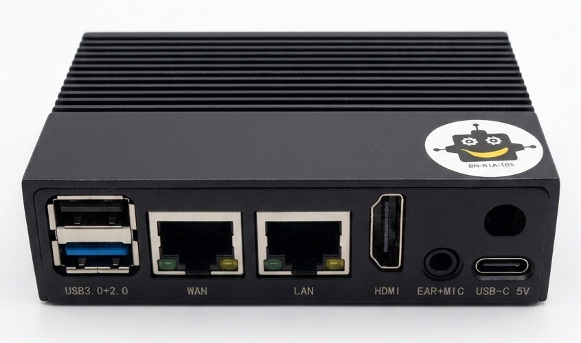
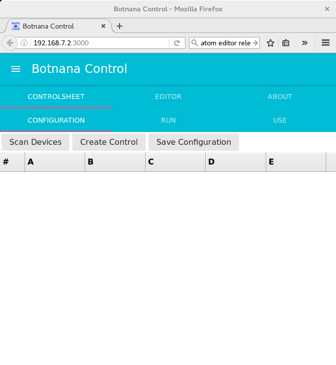

# Botnana Control 簡報

---

## 1. 關於 Botnana Control

**Botnana Control 是什麼?**

*   一款工業以太網 **EtherCAT** 控制器的快速開發以及學習環境。
*   目標是幫助使用者快速開發以工業以太網 EtherCAT 為基礎的自動控制以及工業物聯網應用。

**應用領域**

*   **資料收集**: 做為 Remote Control Unit (RTU) 使用。
*   **軸控**: 可透過 EtherCAT 控制 1-16 軸的馬達。
*   **PLC 控制**: 可透過 EtherCAT IO 模組進行類似 PLC 的控制。
*   **IIoT**: 透過內建的 Websocket 伺服器，和客戶的雲端服務或 HMI 整合。
*   **CNC 控制器**。

---

## 2. 系統架構

Botnana 控制平台架構分為兩大部分：

*   **非實時部分 (Linux)**
    *   執行於 Linux 作業系統。
    *   提供 HTTP 伺服器 (用於 Web 管理介面) 與 Websocket 伺服器 (用於 API 通訊)。
    *   處理系統設定與檔案儲存。

*   **實時部分 (Real-time Kernel)**
    *   執行於實時核心 (Xenomai)。
    *   **硬體抽象層**: 支援各家 EtherCAT 從站裝置。
    *   **軸控引擎**: 包括軸組、運動學、路徑預視、補間功能。
    *   **rtForth 虛擬機**: 執行實時腳本語言，實現複雜的即時控制邏輯。

---

## 3. 硬體介紹：Botnana BN-B3A

霸那 BN-B3A 是 Botnana Control 的主要支援硬體。

**硬體規格**

| 項目         | 規格                                                 |
| ------------ | ---------------------------------------------------- |
| CPU          | RK3566 (4 core ARM Cortex-A55, 1.8GHz)               |
| RAM          | 2GB LPDDR4/4X                                        |
| 儲存空間     | 8GB eMMC (可透過 TF 卡擴充)                           |
| 網路         | 1x 1000M WAN (eth0)                                  |
| **EtherCAT** | 1x Realtek RTL8111/8168/8411 (eth1, LAN port)         |
| USB          | 1x USB3.0, 1x USB2.0, 1x USB-C (OTG/Power)           |
| 顯示         | HDMI 2.0                                             |

**產品型號**

| 型號       | 可控軸數 | 最大 EtherCAT 從站數量 |
| ---------- | -------: | -------------------------: |
| BN-B3A-10S | 10       | 16                         |



---

## 4. 軟體規格

| 項目              | 規格                                                         |
| ----------------- | ------------------------------------------------------------ |
| Operating system  | Linux Debian Buster (4.19.232-rt104)                         |
| Real-time System  | Preempt RT + Xenomai 3.2.3                                   |
| EtherCAT Master   | BotnanaCAT 2.0.1 (based on IgH EtherCAT master)              |
| Botnana Control   | v1.14.4                                                      |
| **執行週期**      | **2ms**                                                      |
| **支援從站數量**  | **1-16**                                                     |
| **支援驅動模式**  | PP, PV, HM, CSP, CSV                                         |

**核心功能**
* 自動偵測 EtherCAT 從站。
* 支援多種廠牌的馬達驅動器與 IO 模組。
* 二軸與三軸同動及直線圓弧補間。
* 多軸組功能與即時腳本 (rtForth) 編程。

---

## 5. 快速入門

透過幾個簡單步驟即可開始使用 Botnana Control。

1.  **硬體連接**: 使用 Type-C 線連接 BN-B3A (OTG port) 到電腦的 USB port。
2.  **安裝驅動**: 若使用 Windows，請安裝 RNDIS 驅動程式。
3.  **設定IP**: 在電腦上設定 IP 為 `192.168.7.1`，子網路遮罩為 `255.255.255.0`。
4.  **開啟 Web 介面**: 使用瀏覽器訪問 **`http://192.168.7.2:3000`** 即可看到 Botnana Control 的控制頁面。



---

## 6. 程式開發介面

Botnana Control 提供多樣化的 API，方便與各種應用程式整合。

*   **JSON API**
    *   基於 JSON-RPC 2.0 規範，透過 Websocket 進行通訊。
    *   適用於任何支援 JSON 與 Websocket 的語言 (C#, C++, Python, ...)。

*   **Javascript API**
    *   提供 npm 套件，簡化在 Node.js 或瀏覽器上的開發流程。
    *   封裝了底層 JSON-RPC 通訊，提供更直觀的物件與事件驅動介面。

*   **Real-time Script API (rtForth)**
    *   在裝置上直接執行的即時腳本語言。
    *   用於實現複雜、高效能且要求低延遲的控制邏輯。

---

## 7. 深入 rtForth：即時腳本編程

rtForth 是 Botnana Control 內建的強大工具，可直接在實時核心中執行控制程式。

**特色**
*   基於 Forth VM，效能優異。
*   可定義新指令、流程控制，實現複雜邏輯。
*   直接存取硬體抽象層，進行精準的軸控與 I/O 操作。

**範例：2D 運動控制**
以下程式碼定義了一個 `test-2d` 指令，驅動一個 2D 軸組走一個矩形路徑後接一個圓弧。

```forth
: test-2d                          \ 定義 test-2d 指令
    +coordinator                   \ 啟動軸運動控制模式
    start-job                      \ 啟動加減速機制
    1 group! +group                \ 啟動 Group 1
    0path                          \ 清除路徑
    0.0e  0.0e  move2d             \ 宣告目前位置為起始點 (0.0, 0.0)
    0.1e  0.0e  line2d             \ 插入直線路徑到 (0.1, 0.0)
    0.1e  0.1e  line2d             \ 插入直線路徑到 (0.1, 0.1)
    0.0e  0.1e  line2d             \ 插入直線路徑到 (0.0, 0.1)
    0.0e  0.05e 0.0e 0.0e 1 arc2d  \ 以 (0.0, 0.05) 為圓心畫圓弧回到 (0.0, 0.0)
    100.0e mm/min vcmd!            \ 設定運動速度
    begin                          \ 等待運動結束
        1 group! gend? not
    while
        pause
    repeat
    1 group! -group                \ 關閉 Group 1
;

deploy test-2d ;deploy             \ 在背景執行 test-2d
```

---

## 8. 核心運動控制功能

Botnana Control 提供完整的運動控制核心功能。

**Coordinator (同動控制)**
*   實現多軸同步運動，適用於要求高精度同步的應用。
*   基於 EtherCAT 的時間同步特性 (DC)。
*   需搭配支援 CSP (Cyclic Synchronous Position) 模式的驅動器。

**Group (軸組)**
*   將多個獨立的運動軸組合成一個運動單元。
*   **支援類型**: 1D, 2D, 3D, 弦波 (Sine wave)。
*   **路徑規劃**:
    *   S 型加減速曲線。
    *   直線與圓弧補間。
    *   路徑預視 (Look-ahead)。

**Drive (驅動裝置)**
*   支援符合 CiA 402 規範的各種 EtherCAT 驅動器。
*   **常用模式**:
    *   **PP**: Profile Position Mode
    *   **PV**: Profile Velocity Mode
    *   **HM**: Homing Mode
    *   **CSP**: Cyclic Sync Position Mode
    *   **CSV**: Cyclic Sync Velocity Mode

---

## 9. 豐富的運動指令集

Botnana Control 提供超過 100 個 rtForth 指令來進行精密的運動控制。

**軸組控制 (Axis Group)**
*   `+group`, `-group`: 啟動/關閉軸組
*   `line2d`, `arc2d`, `line3d`, `helix3d`: 定義 2D/3D 運動路徑
*   `move2d`, `pcs2d`: 設定工件座標系 (PCS)
*   `vcmd!`, `feedrate!`: 控制運動速度

**單軸控制 (Axis)**
*   `+interpolator`, `-interpolator`: 啟動/停止單軸點對點運動
*   `axis-cmd-p!`: 設定目標位置
*   `0axis-ferr`: 清除跟隨誤差

**驅動器控制 (Drive)**
*   `drive-on`, `drive-off`: Servo On/Off
*   `op-mode!`: 切換驅動器操作模式 (PP, HM, CSP...)
*   `go`, `target-p!`: 在 PP 模式下觸發運動
*   `reset-fault`: 清除驅動器警報

---

## 10. 結論與資源

**總結**

Botnana Control 提供了一個整合硬體、軟體與開發工具的完整 EtherCAT 控制方案。無論是簡單的 I/O 控制、複雜的多軸運動，還是工業物聯網應用，Botnana Control 都能提供高效能且具彈性的解決方案。

**相關資源**

*   **Botnana Book (官方文件):**
    [https://botnana.github.io/botnana-book/](https://botnana.github.io/botnana-book/)

*   **API 函式庫 (Github):**
    [https://github.com/botnana/botnana-apis](https://github.com/botnana/botnana-apis)

### 謝謝！
