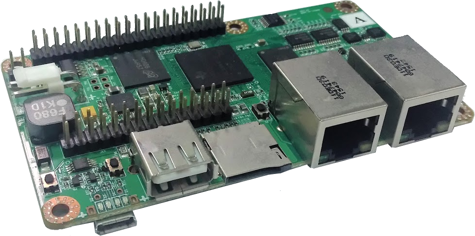

## Botnana A2

霸蕉控制器 (Botnana Control) 支援霸蕉 A2 (Botnana A2)。

霸蕉 A2 規格如下：

* AM3357 800MHz ARM Cortex A8
* 512MB DDR3L@400MHz RAM
* 4GB 8-bit eMMC on-board flash storage
* 1x microSD
* NEON floating-point accelerator
* 1x micro USB 2.0 client (USB0) for power and communication
* 1x USB 2.0 host (USB1), TYPE A socket
* 2x Ethernet 10/100MHz
* 40-pin connector compatible with Raspberry Pi Model B+’s 40-pin connector
* 26-pin connector to supply daughterboard with 12/24 volts power
* 34 GPIOs which provides 2 x SPI, 3 x I2C, 2 x CAN, 4 x Timers, 2 x eQEP, PWMs, 2 x eCAP, 4 x UARTs
* 7 Analog inputs
* Selection of EtherCAT master mode and EtherCAT slave mode through installed software

40 Pins 腳位屬性：

Pin number | ZCZ Ball number | Pin name  | Signal name            | Mode | TYPE
-----------|-----------------|-----------|------------------------|------|------
3          | D18             | I2C2_SDA  | uart1_ctsn             | 0    | I
           |                 |           | timer6                 | 1    | I/O
           |                 |           | dcan0_tx               | 2    | O
           |                 |           | I2C2_SDA               | 3    | I/OD
           |                 |           | spi1_cs0               | 4    | I/O
           |                 |           | pr1_uart0_cts_n        | 5    | I
           |                 |           | pr1_edc_latch0_in      | 6    | I
           |                 |           | gpio0_12               | 7    | I/O
5          | D17             | I2C2_SCL  | uart1_rtsn             | 0    | O
           |                 |           | timer5                 | 1    | I/O
           |                 |           | dcan0_rx               | 2    | I
           |                 |           | I2C2_SCL               | 3    | I/OD
           |                 |           | spi1_cs1               | 4    | I/O
           |                 |           | pr1_uart0_rts_n        | 5    | O  |                 |           | pr1_edc_latch1_in      | 6    | I
           |                 |           | gpio0_13               | 7    | I/O
7          | R7              | TIMER4    | gpmc_advn_ale          | 0    | O
           |                 |           | timer4                 | 2    | I/O
           |                 |           | gpio2_2                | 7    | I/O
8          | D15             | UART1_TXD | uart1_txd              | 0    | O
           |                 |           | mmc2_sdwp              | 1    | I
           |                 |           | dcan1_rx               | 2    | I
           |                 |           | I2C1_SCL               | 3    | I/OD
           |                 |           | pr1_uart0_txd          | 5    | O
           |                 |           | pr1_pru0_pru_r31_16    | 6    | I
           |                 |           | gpio0_15               | 7    | I/O
10         | D16             | UART1_RXD | uart1_rxd              | 0    | I
           |                 |           | mmc1_sdwp              | 1    | I
           |                 |           | dcan1_tx               | 2    | O
           |                 |           | I2C1_SDA               | 3    | I/OD
           |                 |           | pr1_uart0_rxd          | 5    | I
           |                 |           | pr1_pru1_pru_r31_16    | 6    | I
           |                 |           | gpio0_14               | 7    | I/O
11         | A13             | GPIO3_14  | mcasp0_aclkx           | 0    | I/O
           |                 |           | ehrpwm0A               | 1    | O
           |                 |           | spi1_sclk              | 3    | I/O
           |                 |           | mmc0_sdcd              | 4    | I
           |                 |           | pr1_pru0_pru_r30_0     | 5    | O
           |                 |           | pr1_pru0_pru_r31_0     | 6    | I
           |                 |           | gpio3_14               | 7    | I/O
12         | U10             | EHRPWM2A  | gpmc_ad8               | 0    | I/O
           |                 |           | lcd_data23             | 1    | O
           |                 |           | mmc1_dat0              | 2    | I/O
           |                 |           | mmc2_dat4              | 3    | I/O
           |                 |           | ehrpwm2A               | 4    | O
           |                 |           | pr1_mii_mt0_clk        | 5    | I
           |                 |           | gpio0_22               | 7    | I/O
13         | B13             | GPIO3_15  | mcasp0_fsx             | 0    | I/O
           |                 |           | ehrpwm0B               | 1    | O
           |                 |           | spi1_d0                | 3    | I/O
           |                 |           | mmc1_sdcd              | 4    | I
           |                 |           | pr1_pru0_pru_r30_1     | 5    | O
           |                 |           | pr1_pru0_pru_r31_1     | 6    | I
           |                 |           | gpio3_15               | 7    | I/O
15         | C12             | GPIO3_17  | mcasp0_ahclkr          | 0    | I/O
           |                 |           | ehrpwm0_synci          | 1    | I
           |                 |           | mcasp0_axr2            | 2    | I/O
           |                 |           | spi1_cs0               | 3    | I/O
           |                 |           | eCAP2_in_PWM2_out      | 4    | I/O
           |                 |           | pr1_pru0_pru_r30_3     | 5    | O
           |                 |           | pr1_pru0_pru_r31_3     | 6    | I
           |                 |           | gpio3_17               | 7    | I/O
16         | T10             | EHRPWM2B  | gpmc_ad9               | 0    | I/O
           |                 |           | lcd_data22             | 1    | O
           |                 |           | mmc1_dat1              | 2    | I/O
           |                 |           | mmc2_dat5              | 3    | I/O
           |                 |           | ehrpwm2B               | 4    | O
           |                 |           | pr1_mii0_col           | 5    | I
           |                 |           | gpio0_23               | 7    | I/O
18         | T11             | GPIO0_26  | gpmc_ad10              | 0    | I/O
           |                 |           | lcd_data21             | 1    | O
           |                 |           | mmc1_dat2              | 2    | I/O
           |                 |           | mmc2_dat6              | 3    | I/O
           |                 |           | ehrpwm2_tripzone_input | 4    | I
           |                 |           | pr1_mii0_txen          | 5    | O
           |                 |           | gpio0_26               | 7    | I/O
19         | E17             | SPI1_D1   | uart0_rtsn             | 0    | O
           |                 |           | uart4_txd              | 1    | O
           |                 |           | dcan1_rx               | 2    | I
           |                 |           | I2C1_SCL               | 3    | I/OD
           |                 |           | spi1_d1                | 4    | I/O
           |                 |           | spi1_cs0               | 5    | I/O
           |                 |           | pr1_edc_sync1_out      | 6    | O
           |                 |           | gpio1_9                | 7    | I/O
21         | E18             | SPI1_D0   | uart0_ctsn             | 0    | I
           |                 |           | uart4_rxd              | 1    | I
           |                 |           | dcan1_tx               | 2    | O
           |                 |           | I2C1_SDA               | 3    | I/OD
           |                 |           | spi1_d0                | 4    | I/O
           |                 |           | timer7                 | 5    | I/O
           |                 |           | pr1_edc_sync0_out      | 6    | O
           |                 |           | gpio1_8                | 7    | I/O
22         | U12             | GPIO0_27  | gpmc_ad11              | 0    | I/O
           |                 |           | lcd_data20             | 1    | O
           |                 |           | mmc1_dat3              | 2    | I/O
           |                 |           | mmc2_dat7              | 3    | I/O
           |                 |           | ehrpwm0_synco          | 4    | O
           |                 |           | pr1_mii0_txd3          | 5    | O
           |                 |           | gpio0_27               | 7    | I/O
23         | C18             | SPI1_SCLK | eCAP0_in_PWM0_out      | 0    | I/O
           |                 |           | uart3_txd              | 1    | O
           |                 |           | spi1_cs1               | 2    | I/O
           |                 |           | pr1_ecap0_ecap_capin_apwm_o| 3| I/O
           |                 |           | spi1_sclk              | 4    | I/O
           |                 |           | mmc0_sdwp              | 5    | I
           |                 |           | xdma_event_intr2       | 6    | I
           |                 |           | gpio0_7                | 7    | I/O
24         | E15             | SPI1_CS0  | uart0_rxd              | 0    | I
           |                 |           | spi1_cs0               | 1    | I/O
           |                 |           | dcan0_tx               | 2    | O
           |                 |           | I2C2_SDA               | 3    | I/OD
           |                 |           | eCAP2_in_PWM2_out      | 4    | I/O
           |                 |           | pr1_pru1_pru_r30_14    | 5    | O
           |                 |           | pr1_pru1_pru_r31_14    | 6    | I
           |                 |           | gpio1_10               | 7    | I/O
26         | E16             | SPI1_CS1  | uart0_txd              | 0    | O
           |                 |           | spi1_cs1               | 1    | I/O
           |                 |           | dcan0_rx               | 2    | I
           |                 |           | I2C2_SCL               | 3    | I/OD
           |                 |           | eCAP1_in_PWM1_out      | 4    | I/O
           |                 |           | pr1_pru1_pru_r30_15    | 5    | O
           |                 |           | pr1_pru1_pru_r31_15    | 6    | I
           |                 |           | gpio1_11               | 7    | I/O
27         | C17             | I2C0_SDA  | I2C0_SDA               | 0    | I/OD
           |                 |           | timer4                 | 1    | I/O
           |                 |           | uart2_ctsn             | 2    | I
           |                 |           | eCAP2_in_PWM2_out      | 3    | I/O
           |                 |           | gpio3_5                | 7    | I/O
28         | C16             | I2C0_SCL  | I2C0_SCL               | 0    | I/OD
           |                 |           | timer7                 | 1    | I/O
           |                 |           | uart2_rtsn             | 2    | O
           |                 |           | eCAP1_in_PWM1_out      | 3    | I/O
           |                 |           | gpio3_6                | 7    | I/O
29         | U6              | TIMER6    | gpmc_wen               | 0    | O
           |                 |           | timer6                 | 2    | I/O
           |                 |           | gpio2_4                | 7    | I/O
31         | T7              | TIMER7    | gpmc_oen_ren           | 0    | O
           |                 |           | timer7                 | 2    | I/O
           |                 |           | gpio2_3                | 7    | I/O
32         | D12             | GPIO3_16  | mcasp0_axr0            | 0    | I/O
           |                 |           | ehrpwm0_tripzone_input | 1    | I
           |                 |           | spi1_d1                | 3    | I/O
           |                 |           | mmc2_sdcd              | 4    | I
           |                 |           | pr1_pru0_pru_r30_2     | 5    | O
           |                 |           | pr1_pru0_pru_r31_2     | 6    | I
           |                 |           | gpio3_16               | 7    | I/O
33         | U13             | GPIO1_15  | gpmc_ad15              | 0    | I/O
           |                 |           | lcd_data16             | 1    | O
           |                 |           | mmc1_dat7              | 2    | I/O
           |                 |           | mmc2_dat3              | 3    | I/O
           |                 |           | eQEP2_strobe           | 4    | I/O
           |                 |           | pr1_ecap0_ecap_capin_apwm_o| 5| I/O
           |                 |           | pr1_pru0_pru_r31_15    | 6    | I
           |                 |           | gpio1_15               | 7    | I/O
35         | B17             | SPI0_D0   | spi0_d0                | 0    | I/O
           |                 |           | uart2_txd              | 1    | O
           |                 |           | I2C2_SCL               | 2    | I/OD
           |                 |           | ehrpwm0B               | 3    | O
           |                 |           | pr1_uart0_rts_n        | 4    | O
           |                 |           | pr1_edio_latch_in      | 5    | I
           |                 |           | EMU3                   | 6    | I/O
           |                 |           | gpio0_3                | 7    | I/O
36         | A16             | SPI0_CS0  | spi0_cs0               | 0    | I/O
           |                 |           | mmc2_sdwp              | 1    | I
           |                 |           | I2C1_SCL               | 2    | I/OD
           |                 |           | ehrpwm0_synci          | 3    | I
           |                 |           | pr1_uart0_txd          | 4    | O
           |                 |           | pr1_edio_data_in1      | 5    | I
           |                 |           | pr1_edio_data_out1     | 6    | I/O
           |                 |           | gpio0_5                | 7    | I/O
37         | A14             | GPIO3_21  | mcasp0_ahclkx          | 0    | I/O
           |                 |           | eQEP0_strobe           | 1    | I/O
           |                 |           | mcasp0_axr3            | 2    | I/O
           |                 |           | mcasp1_axr1            | 3    | I/O
           |                 |           | EMU4                   | 4    | I/O
           |                 |           | pr1_pru0_pru_r30_7     | 5    | O
           |                 |           | pr1_pru0_pru_r31_7     | 6    | I
           |                 |           | gpio3_21               | 7    | I/O
38         | B16             | SPI0_D1   | spi0_d1                | 0    | I/O
           |                 |           | mmc1_sdwp              | 1    | I
           |                 |           | I2C1_SDA               | 2    | I/OD
           |                 |           | ehrpwm0_tripzone_input | 3    | I
           |                 |           | pr1_uart0_rxd          | 4    | I
           |                 |           | pr1_edio_data_in0      | 5    | I
           |                 |           | pr1_edio_data_out0     | 6    | O
           |                 |           | gpio0_4                | 7    | I/O
40         | A17             | SPI0_SCLK | spi0_sclk              | 0    | I/O
           |                 |           | uart2_rxd              | 1    | I
           |                 |           | I2C2_SDA               | 2    | I/OD
           |                 |           | ehrpwm0A               | 3    | O
           |                 |           | pr1_uart0_cts_n        | 4    | I
           |                 |           | pr1_edio_sof           | 5    | O
           |                 |           | EMU2                   | 6    | I/O
           |                 |           | gpio0_2                | 7    | I/O

30 Pins 腳位屬性：

Pin number | ZCZ Ball number | Pin name  | Signal name            | Mode | TYPE
-----------|-----------------|-----------|------------------------|------|------
11         | T12             | eQEP2A_in | gpmc_ad12              | 0    | I/O
           |                 |           | lcd_data19             | 1    | O
           |                 |           | mmc1_dat4              | 2    | I/O
           |                 |           | mmc2_dat0              | 3    | I/O
           |                 |           | eQEP2A_in              | 4    | I
           |                 |           | pr1_mii0_txd2          | 5    | O
           |                 |           | pr1_pru0_pru_r30_14    | 6    | O
           |                 |           | gpio1_12               | 7    | I/O
13         | R12             | eQEP2B_in | gpmc_ad13              | 0    | I/O
           |                 |           | lcd_data18             | 1    | O
           |                 |           | mmc1_dat5              | 2    | I/O
           |                 |           | mmc2_dat1              | 3    | I/O
           |                 |           | eQEP2B_in              | 4    | I
           |                 |           | pr1_mii0_txd1          | 5    | O
           |                 |           | pr1_pru0_pru_r30_15    | 6    | O
           |                 |           | gpio1_13               | 7    | I/O
14         | D14             | CLKOUT2   | xdma_event_intr1       | 0    | I
           |                 |           | tclkin                 | 2    | I
           |                 |           | clkout2                | 3    | O
           |                 |           | timer7                 | 4    | I/O
           |                 |           | pr1_pru0_pru_r31_16    | 5    | I
           |                 |           | EMU3                   | 6    | I/O
           |                 |           | gpio0_20               | 7    | I/O
15         | V13             | eQEP2_index| gpmc_ad14             | 0    | I/O
           |                 |           | lcd_data17             | 1    | O
           |                 |           | mmc1_dat6              | 2    | I/O
           |                 |           | mmc2_dat2              | 3    | I/O
           |                 |           | eQEP2_index            | 4    | I/O
           |                 |           | pr1_mii0_txd0          | 5    | O
           |                 |           | pr1_pru0_pru_r31_14    | 6    | I
           |                 |           | gpio1_14               | 7    | I/O
16         | B12             | eQEP0A_in | mcasp0_aclkr           | 0    | I/O
           |                 |           | eQEP0A_in              | 1    | I
           |                 |           | mcasp0_axr2            | 2    | I/O
           |                 |           | mcasp1_aclkx           | 3    | I/O
           |                 |           | mmc0_sdwp              | 4    | I
           |                 |           | pr1_pru0_pru_r30_4     | 5    | O
           |                 |           | pr1_pru0_pru_r31_4     | 6    | I
           |                 |           | gpio3_18               | 7    | I/O
17         | T3              | GPIO2_12  | lcd_data6              | 0    | I/O
           |                 |           | gpmc_a6                | 1    | O
           |                 |           | pr1_edio_data_in6      | 2    | I
           |                 |           | eQEP2_index            | 3    | I/O
           |                 |           | pr1_edio_data_out6     | 4    | O
           |                 |           | pr1_pru1_pru_r30_6     | 5    | O
           |                 |           | pr1_pru1_pru_r31_6     | 6    | I
           |                 |           | gpio2_12               | 7    | I/O
18         | C13             | eQEP0B_in | mcasp0_fsr             | 0    | I/O
           |                 |           | eQEP0B_in              | 1    | I
           |                 |           | mcasp0_axr3            | 2    | I/O
           |                 |           | mcasp1_fsx             | 3    | I/O
           |                 |           | EMU2                   | 4    | I/O
           |                 |           | pr1_pru0_pru_r30_5     | 5    | O
           |                 |           | pr1_pru0_pru_r31_5     | 6    | I
           |                 |           | gpio3_19               | 7    | I/O
19         | T4              | GPIO2_13  | lcd_data7              | 0    | I/O
           |                 |           | gpmc_a7                | 1    | O
           |                 |           | pr1_edio_data_in7      | 2    | I
           |                 |           | eQEP2_strobe           | 3    | I/O
           |                 |           | pr1_edio_data_out7     | 4    | O
           |                 |           | pr1_pru1_pru_r30_7     | 5    | O
           |                 |           | pr1_pru1_pru_r31_7     | 6    | I
           |                 |           | gpio2_13               | 7    | I/O
20         | D13             | eQEP0_index| mcasp0_axr1           | 0    | I/O
           |                 |           | eQEP0_index            | 1    | I/O
           |                 |           | mcasp1_axr0            | 3    | I/O
           |                 |           | EMU3                   | 4    | I/O
           |                 |           | pr1_pru0_pru_r30_6     | 5    | O
           |                 |           | pr1_pru0_pru_r31_6     | 6    | I
           |                 |           | gpio3_20               | 7    | I/O
22         | R5              | GPIO2_23  | lcd_hsync              | 0    | O
           |                 |           | gpmc_a9                | 1    | O
           |                 |           | gpmc_a2                | 2    | O
           |                 |           | pr1_edio_data_in3      | 3    | I
           |                 |           | pr1_edio_data_out3     | 4    | O
           |                 |           | pr1_pru1_pru_r30_9     | 5    | O
           |                 |           | pr1_pru1_pru_r31_9     | 6    | I
           |                 |           | gpio2_23               | 7    | I/O
23         | B6              | AIN0      | AIN0                   | 0    | A
25         | C7              | AIN1      | AIN1                   | 0    | A
26         | B7              | AIN2      | AIN2                   | 0    | A
27         | A7              | AIN3      | AIN3                   | 0    | A
28         | C8              | AIN4      | AIN4                   | 0    | A
29         | B8              | AIN5      | AIN5                   | 0    | A
30         | A8              | AIN6      | AIN6                   | 0    | A
