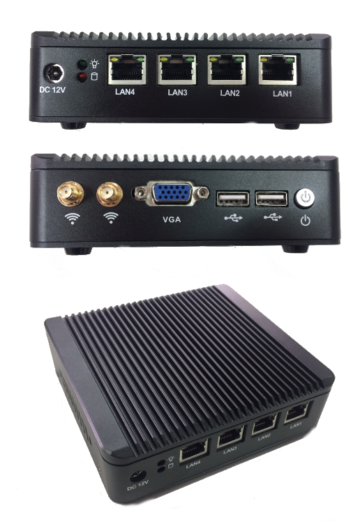

## Botnana BN-J4A

霸那控制器 (Botnana Control) 支援 x86 電腦。

x86 電腦規格如下：

* Dimension   : 
    * 134x126x38mm  
* Onboard CPU :
    * Intel Celeron Processor J1900 |
* Front-Panel Connectors:
   * Power on/off
   * Power LED
   * 2 x USB 2.0 Ports 
   * 1 x VGA Port
   * WiFi  
* Back-Panel Connectors
   * 1 × DV 12V input
   * Power LED, HDD LED
   * LAN1 (EtherCAT)
   * LAN2 (Reserved for EtherCAT)
   * LAN3 (Reserved for Ethernet)
   * LAN4 (Ethernet) (ip: 192.168.7.2)
  