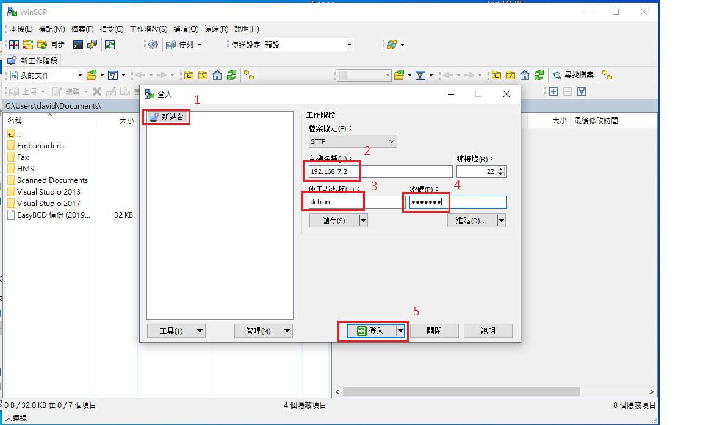
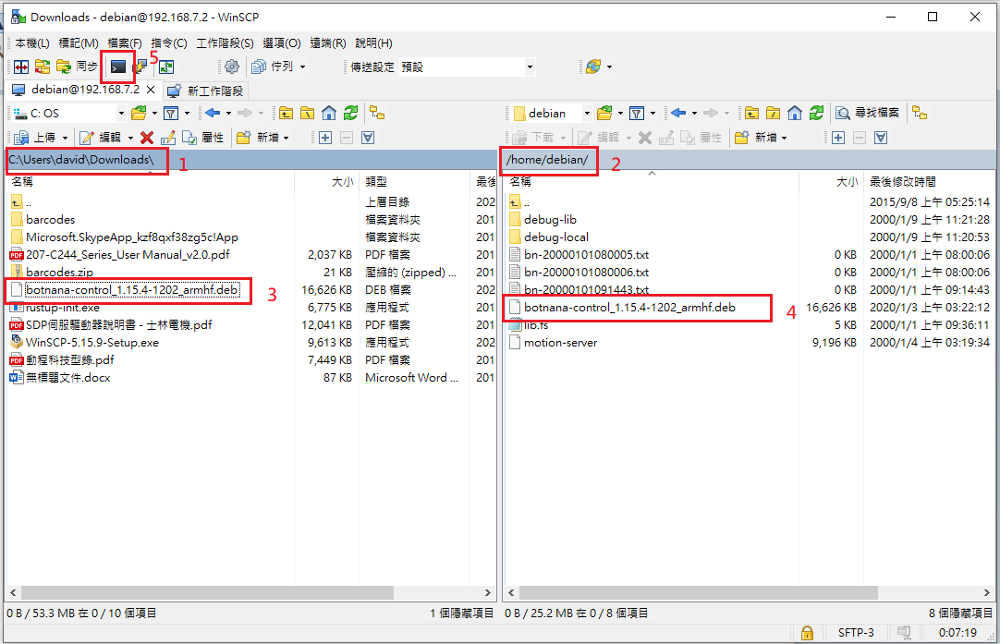
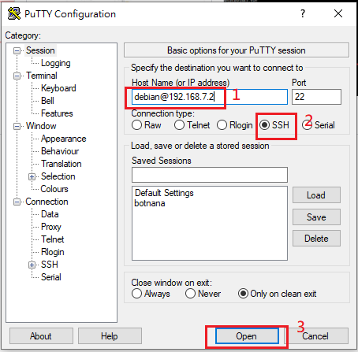

# 手動安裝 Botnana Control 更新檔(.deb)

一般來說建議使用 Botnana Web Utils 進行更新檔安裝，說明可參考[軟體更新](../../update-software.md)。

若是安裝過程發生意外錯誤，導致無法再使用 Botnana Web Utils 進行安裝，則可以手動執行安裝進行修復，步驟如下。

## 1. 傳送安裝檔至 Botnana

### 在 Windows 上操作

請至[這裡](https://winscp.net/eng/download.php)下載並安裝 winscp 。

  
1. 開啟 winscp 後建立新站台
2. 輸入 Botnana 的 ip 位址，預設為 192.168.7.2
3. 輸入 Botnana 上預設的使用者名稱 debian
4. 輸入密碼 temppwd
5. 登入

  
登入後視窗左邊為 PC 本機的磁碟目錄，右邊為 Botnana 上的磁碟目錄。
1. 本機索引至 Botnana Control 更新檔存放的位置
2. Botnana 索引至 /home/debian
3. 將安裝檔拖曳至 Botnana 中

### 在 Linux 上操作

索引至安裝檔所的位置，例如在家目錄 Downloads 中
```
$ cd ~/Downloads/
```
使用 `scp` 指令將安裝檔複製到 Botnana 上，例如安裝檔名稱為 `botnana-control_1.15.4-1202_armhf.deb`
```
$ scp botnana-control_1.15.4-1202_armhf.deb debian@192.168.7.2:~
```
依照提示輸入密碼 `temppwd`，顯示下列訊息表示成功
```
botnana-control_1.15.4-1202_armhf.deb              100%   16MB   3.2MB/s   00:05
```

## 2. ssh 連線登入 Botnana

### 在 Windows 上操作

請至[這裡](https://www.putty.org/)下載並安裝 putty 。

  
按照上圖輸入使用者名稱與 ip 位址後開啟連線，並依據提示輸入密碼 `temppwd`

### 在 Linux 上操作

在終端機中輸入
```
$ ssh debian@192.168.7.2
```
並依據提示輸入密碼 `temppwd`


## 3. 手動安裝更新檔

輸入 `dpkg -l botnana-control` 可以查看目前安裝的 botnana-control 版本，例如
```
debian@arm:~$ dpkg -l botnana-control
Desired=Unknown/Install/Remove/Purge/Hold
| Status=Not/Inst/Conf-files/Unpacked/halF-conf/Half-inst/trig-aWait/Trig-pend
|/ Err?=(none)/Reinst-required (Status,Err: uppercase=bad)
||/ Name              Version    Architecture    Description
+++-=================-==========-===============-==============================
ii  botnana-control   1.13.25    armhf           Botnana Control IIOT Platform
```

輸入 `sudo dpkg -r botnana-control` 可以移除目前安裝的 botnana-control，例如
```
debian@arm:~$ sudo dpkg -r botnana-control
[sudo] password for debian: 
(Reading database ... 50512 files and directories currently installed.)
Removing botnana-control (1.13.25) ...
Processing triggers for systemd (215-17+deb8u2) ...
```

將 botnana-control 更新檔移至更新目錄，例如
```
debian@arm:~$ sudo mv botnana-control_1.15.4-1202_armhf.deb /opt/mapacode/botnana-control/update/
debian@arm:~$ cd /opt/mapacode/botnana-control/update/
debian@arm:/opt/mapacode/botnana-control/update$ ls
botnana-control_1.15.4-1202_armhf.deb  dpkg.log
```

若發現 update 目錄裡有殘留舊的安裝檔可以將其移除，例如有一個舊的安裝檔名稱為`botnana-control_1.13.0-0101_armhf.deb`
```
sudo rm botnana-control_1.13.0-0101_armhf.deb
```

安裝 botnana-control 更新檔，例如
```
debian@arm:/opt/mapacode/botnana-control/update$ sudo dpkg -i botnana-control_1.15.4-1202_armhf.deb 
Selecting previously unselected package botnana-control.
(Reading database ... 28587 files and directories currently installed.)
Preparing to unpack botnana-control_1.15.4-1202_armhf.deb ...
Unpacking botnana-control (1.15.4) ...
Setting up botnana-control (1.15.4) ...
Processing triggers for systemd (215-17+deb8u2) ...
```

查看安裝結果
```
debian@arm:/opt/mapacode/botnana-control/update$ sudo dpkg -l botnana-control
Desired=Unknown/Install/Remove/Purge/Hold
| Status=Not/Inst/Conf-files/Unpacked/halF-conf/Half-inst/trig-aWait/Trig-pend
|/ Err?=(none)/Reinst-required (Status,Err: uppercase=bad)
||/ Name              Version   Architecture   Description
+++-=================-=========-==============-=============================
ii  botnana-control   1.15.4    armhf          Botnana Control IIOT Platform
```
botnana-control 名稱前面顯示 `ii` 表示正確安裝  

重新啟動 Botnana
```
$ sudo reboot
```

重新啟動後 Botnana 將會自動按照正常的更新流程再次安裝我們剛才提供的更新檔，因此啟動時間會稍長。  
靜待 Botnana 完成更新後(Botnana Web Utils 可以開啟)即修復且完成更新。