## WINDOWS 10 透過 MicroUSB 與 Botnana A2 連線時需先安裝 RNDIS 驅動程式

#### 0. 將 Botnana-A2 microUSB埠 與 電腦 連接。
註解︰若已嘗試過安裝 RNDIS 驅動程式，請從步驟 1 開始；否則，請直接從步驟 3 開始。

#### 1. 裝置管理員 出現如下裝置

#### 2. 解除安裝裝置

#### 3. 修改 C:\Windows\INF\usbser.inf （[關於 usbser.inf 權限問題](#permission)）
將底下這個 
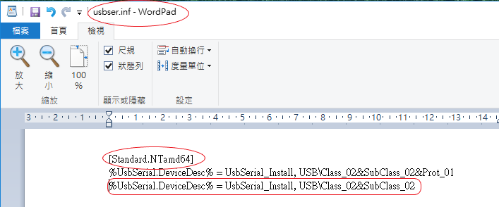
改成如下

#### 4. 選裝置管理員中的  Botnana-A2，並更新驅動程式

#### 5. 選 瀏覽電腦上的驅動程式軟體

#### 6. 選 讓我從電腦上的可用驅動程式清單中挑選
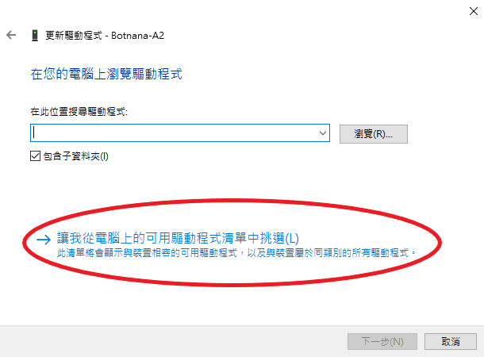

#### 7. 硬體類型選 網路介面卡
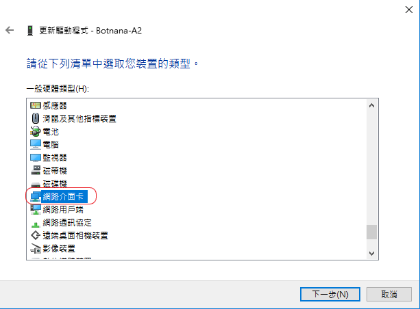

#### 8. 製造商 / 型號︰Microsoft / USB RNDIS介面卡

#### 9. 忽略警告訊息

#### 10. 驅動程式更新成功
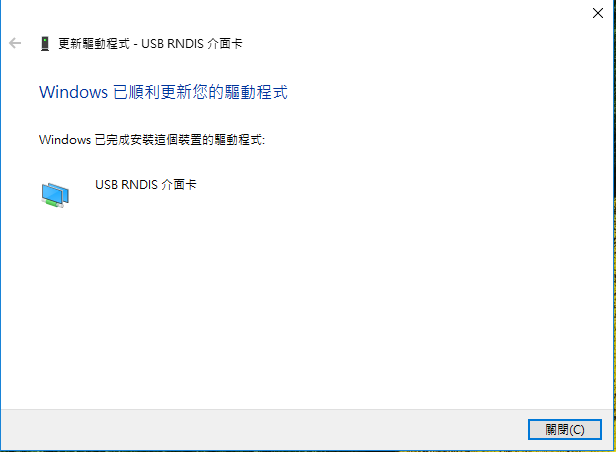

#### 11. 檢查是否出現這個裝置︰裝置管理員/網路介面卡/USB RNDIS介面卡

#### 12. 連線測試（假設用 PuTTY 連線軟體）

#### 13. username / password: debian / temppwd

### 修改權限的步驟 ###
1. 以 C:\Windows\INF\usbstor.inf 檔案為範例
2. 假設登入 Windows 10 的使用者帳號為 felix

#### step 1. 將滑鼠移到 usbstor.inf 上，並按滑鼠右鍵，選 內容 。
#### step 2. 選 安全性 -〉 進階 。
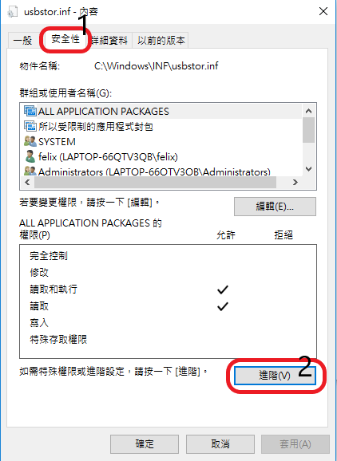

#### step 3. 按 變更 擁有者，輸入使用者帳號，按 檢查名稱，此時會顯示完整的帳號資訊，按 確定 離開。
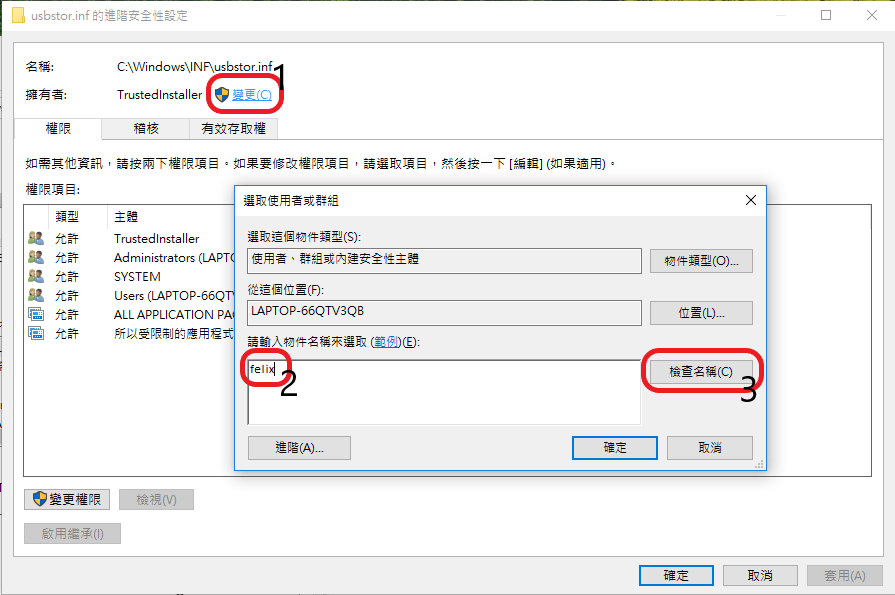

#### step 4. 回到上一層後，按 套用 ，顯示警告訊息，按 確定。
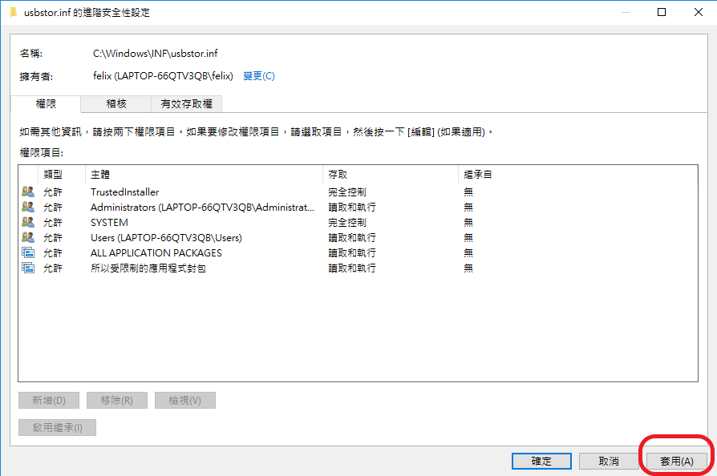

#### step 5. 將顯示 usbstor.inf 內容的視窗全部關閉後，再重開 內容 視窗。

#### step 6. 新增 一個主體。
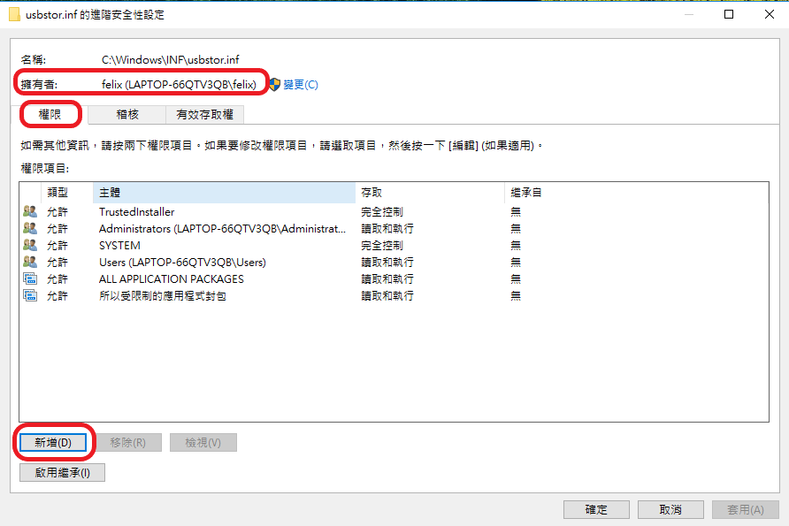

#### step 7. 選取一個主體。
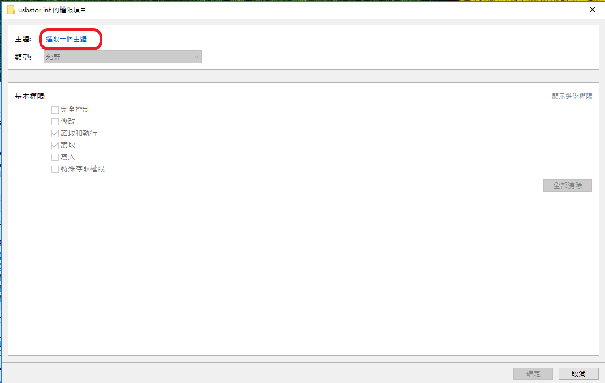

#### step 8. 輸入帳號並檢查名稱，再按確定。
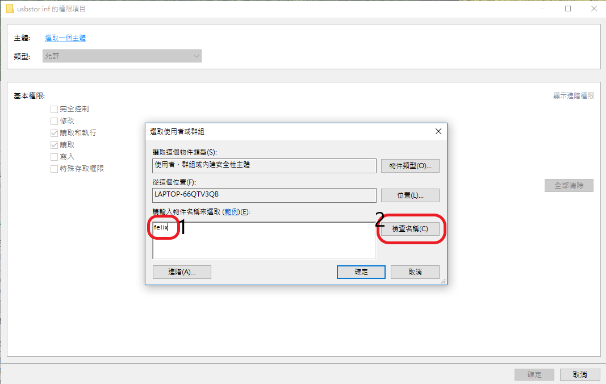

#### step 9. 修改基本權限後，按確定。

#### step 10. 確認帳號已正確加入，並擁有完全控制的權限。
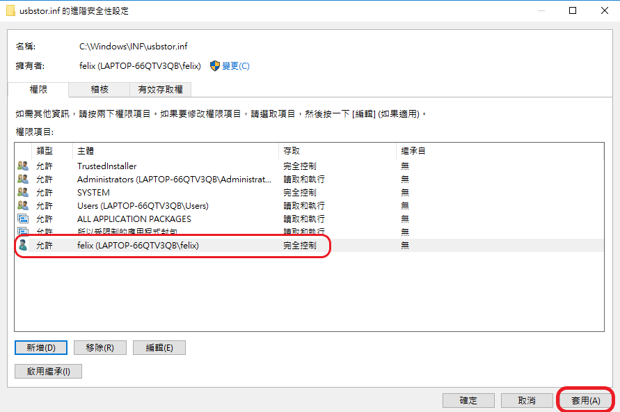

#### step 11. 按 套用及確定，顯示安全警告的訊息，按 是。

