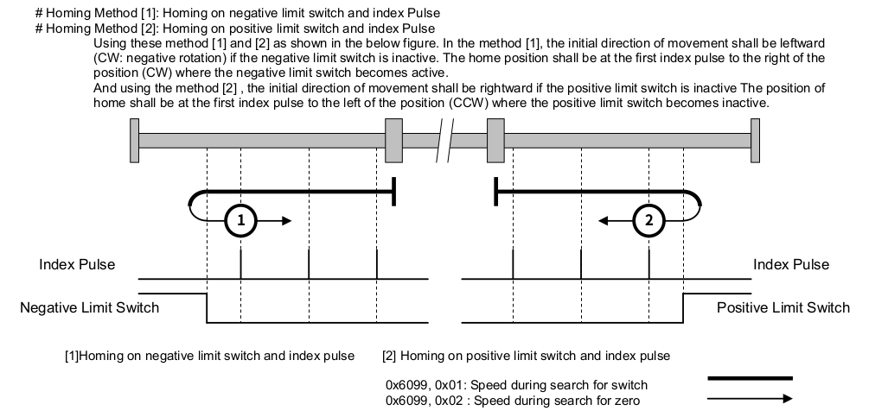
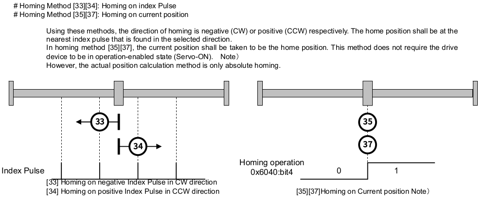

## Homing SFC 範例

此範例為 3 軸回歸機械原點的SFC 。可以與 Servo On/OFF SFC 配合將所有對應的馬達驅動器切換到 Operation Enabled 的狀態，
也可以手動將驅動器切換到 Operation Enabled 以進行此 SFC 的運作。

此範例設計為兩個優先順序的運動軸回歸機械原點，可以完成以下兩種應用：

1. 將運動軸分配為兩個優先順序回歸機械原點。例如先完成 Z 軸後再進行 X，Y軸。
2. 結合兩種回歸機械原點的方法，快速找到準確的機械原點。譬如先使用速度較高的 homing method 1 或是 2 找到 encoder index 大致的地方，再使用 homing method 33 或是 34 搭配較低的速度找到精確的 encoder index 。

以下是節錄 SANMOTION EtherCAT 驅動器 Instruction Manual 中對於 homing method 1, 2, 33 與 34 的說明：

---




---

SFC 設計流程如下：

```
         +-------------+
         |    Init     |  檢查是否對應的驅動器裝置，
         |             |  設定 device-ok? 旗標。
         +-----+-------+
               |
           device-ok?
               |
         +-----v-------+
         |    Idle     |  等待 homing-accepted? 為真。
+--------+             |
|        +-----+-------+
|              |
|        homing-accepted?
|              |
|        +-----v-------+
|        |   Config    |  切換對應驅動器為 HM 模式
|        |             |  設定 homing speed, homing method
|        +-----+-------+
|              |
|         config-ok?      等待 config 設定指令（EtherCAT SDO）完成。
|              |
|        +-----v-------+
|        |   Trigger   |  啟動驅動器開始進行回歸原點動作。（EtherCAT PDO）
|        |             |
|        +-----+-------+
|              |          等待 50 ms 後，才開始檢查回歸原點的結果。
|         trigger-ok?     避免驅動器還未開始回歸原點，檢查到錯誤時機的狀態。
|              |
|        +-----v-------+  檢查驅動器狀態，判斷回歸原點是否完成。
|        |    Loop     |  如果所設定的運動軸都完成回歸原點就設定 loop-stopped? 旗標。
|        |             |
|        +-----+-------+
|              |
|         loop-stopped?
|              |
|        +-----v-------+  將目前佇列中的運動軸切換到 CSP mode
|        | Post Action |  切換到下一個回歸機械原點佇列，
|        |             |  如果所有佇列都已經完成，就將 homing-accepted? 設定為 false。
|        +-----+-------+
|              |
|        post-action-ok?
|              |
+------<-------+


```


## SFC 實作：


```

\ Axes Description
\ 分別為第 1, 2 , 3 運動軸
\ 不使用 index 0 的運動軸
3 constant axes-len
create axes 0 , 1 , 2 , 3 ,

\ 使用 axes-enabled 可以暫時將指定軸排除在此 SFC 的運作邏輯之外
create axes-enabled false , true , true , true ,

\ 取得受控運動軸清單中的軸編號
: axis@ ( index -- axis-no )
    cells axes + @
    ;

\ 取得受控運動軸清單中的致能狀態 (enabled/disabled)
: axis-enabled? ( index -- flag )
    cells axes-enabled + @
    ;

\ 將運動軸清單中的運動軸致能
: +axis  ( index -- )
    cells axes-enabled + true swap !
    ;

\ 將運動軸清單中的運動軸禁能
: -axis  ( index -- )
    cells axes-enabled + false swap !
    ;

\ 定義回歸機械原點的運動軸 （enabled/disbaled)
\ 分為兩個優先順序，first-homing-axes 執行完後，才執行 second-homing-axes
create first-homing-axes false , false , false , false ,
create second-homing-axes false , false , false , false ,

\ 回歸機械原點的速度與方法
\ 速度單位參考驅動器 0x6099 定義的單位，通常是 pulses/sec
create axes-homing-v1     0 , 1000 , 1000 , 1000 ,
create axes-homing-v2     0 , 10 , 10 , 10 ,
\ 要參照驅動器有支援的方法，通常同一個代號會是相同的方法，但不是每一種驅動器都有支援。
create axes-homing-method 0 , 33 , 33 , 33 ,

\ 取得 homing-v1 參數
: axis-homing-v1@ ( index -- v1 )
    cells axes-homing-v1 + @
    ;

\ 取得 homing-v2 參數
: axis-homing-v2@ ( index -- v2 )
    cells axes-homing-v2 + @
    ;

\ 取得 homing-method 參數
: axis-homing-method@ ( index -- method )
    cells axes-homing-method + @
    ;

\ 設定 homing-v1 參數
: axis-homing-v1! ( v1 index -- )
    cells axes-homing-v1 + !
    ;

\ 設定 homing-v2 參數
: axis-homing-v2! ( v2 index -- )
    cells axes-homing-v2 + !
    ;

\ 設定 homing-method 參數
: axis-homing-method! ( method index -- )
    cells axes-homing-method + !
    ;

\ 目前處理的 homing-priority
\ 1 表示處理 first-homing-axes 中啟動的運動軸
\ 2 表示處理 second-homing-axes 中啟動的運動軸
variable homing-priority


\ 在對應的優先佇列內啟動要回歸機械原點的運動軸
: +homing-axis ( index priority -- )
    case
        1 of cells first-homing-axes + true swap ! endof
        2 of cells second-homing-axes + true swap ! endof
        ." log|Invalid homing priority" cr
        swap drop
    endcase
    ;

\ 在對應的優先佇列內取消要回歸機械原點的運動軸
: -homing-axis ( index priority -- )
    case
        1 of cells first-homing-axes + false swap ! endof
        2 of cells second-homing-axes + false swap ! endof
        ." log|Invalid homing priority" cr
        swap drop
    endcase
    ;

\ 在對應的優先佇列內，取得該運動軸是否要回歸機械原點?
: homing-axis? ( index priority -- flag )
    case
        1 of cells first-homing-axes + @ endof
        2 of cells second-homing-axes + @ endof
        ." log|Invalid homing priority" cr
        swap drop false swap
    endcase
    ;

\ 定義 Axes Homing 流程中所需要的變數
variable homing-devices-ok
variable axes-homing-accetped
variable homing-config-once
variable homing-trigger-once
variable homing-loop-stopped
variable homing-post-action-once
variable axes-homing-stopping

\ 啟動 axes homing
\ 使用此指令，決定是否要開始進行回歸機械原點的活動
\ 依據不同的應用調整啟動的條件
: start-axes-homing ( -- )
    homing-priority @ 0= if
        true axes-homing-accetped !
        1 homing-priority !
    else
        ." log|Axes homing not accetped" cr
    then
;

\ 停止 axes homing
\ Homing 執行中要停止的命令，會將對應的驅動器切換到 Quick Stop Activate 的狀態
: stop-axes-homing ( -- )
    homing-priority @ 0<> if
        1
        begin
            dup axes-len <=
        while
            dup axis-enabled? over homing-priority @ homing-axis? and if
                dup axis@ axis-drive@ drive-stop
            then
            1+
        repeat
        drop
        true axes-homing-stopping !
    then
;

\ Homing Init Step
\ 檢查對應的硬體裝置是否存在，只在一開始的時候做一次，如果檢查沒有通過，SFC 會停留在這個 step。
variable homing-init-once
: homing-init ( -- )
    homing-init-once @ not if
        true homing-devices-ok !
        1
        begin
          dup axes-len <=
        while
            dup axis-enabled? over axis@ virtual-axis? and if
                ." error|Axis (" dup axis@ 0 .r  ." ) is virtual axis" cr
                false homing-devices-ok !
            then
            1+
        repeat
        drop

        true homing-init-once !
    then
    ;

\ Homing Idle Step
\ 在此狀態等待 axes-homing-accetped 為真
: homing-idle ( -- )
    ;

\ Homing Config Step
\ 依據優先佇列設定回歸機械原點的參數給驅動器
: homing-config
    homing-config-once @ not if
        1
        begin
          dup axes-len <=
        while
            dup axis-enabled? over homing-priority @ homing-axis? and if
                dup axis@
                over axis-homing-v1@ over axis-drive@ homing-v1!
                over axis-homing-v2@ over axis-drive@ homing-v2!
                over axis-homing-method@ over axis-drive@ homing-method!
                hm swap axis-drive@ op-mode!
            then
            1+
        repeat
        drop
        false homing-trigger-once !
        false homing-post-action-once !
        true homing-config-once !
    then
;

\ Homing Trigger Step
\ 依據優先佇列設定，命令驅動器開始回歸機械原點
: homing-trigger
    homing-trigger-once @ not if
        1
        begin
            dup axes-len <=
        while
            dup axis-enabled? over homing-priority @ homing-axis? and if
                dup axis@ dup axis-drive@ drive-on? if
                    axis-drive@ go
                else
                    drop
                then
            then
            1+
        repeat
        drop
        false homing-config-once !
        true homing-trigger-once !
    then
    ;

\ Homing Loop Step
\ 依據驅動器狀態判定回歸機械原點結果
\ 依據結果設定運動軸狀態
: homing-loop
    true homing-loop-stopped !
    1
    begin
        dup axes-len <=
    while
        dup axis-enabled? over homing-priority @ homing-axis? and if
            dup axis@ dup axis-drive@ target-reached? if
                dup axis-drive@ drive-sw@ $1000 and 0<> if
                    dup ." log|Axis ("  0 .r  ." ) homing attained" cr
                    dup +homed
                else
                    dup ." log|Axis ("  0 .r  ." ) homing error" cr
                    \ 如果回歸機械原點失敗，停止所有運動軸回歸機械原點
                    stop-axes-homing
                    dup -homed
                then
            else
                false homing-loop-stopped !
            then

            \ 如果驅動器不是在 Operation Enabled 狀態，停止所有運動軸回歸機械原點
            dup axis-drive@ drive-on? not if
                stop-axes-homing
                true homing-loop-stopped !
            then

            \ 清除運動軸落後誤差，依實際位置修正命令
            0axis-ferr

        then
        1+
    repeat
    drop

    ;

\ Homing Post Action
\ 將目前佇列中的驅動器換到 CSP 模式
\ 清除目前佇列中的運動軸
\ 判斷是否要切換到下一個佇列或是停止回歸機械原點
: homing-post-action
    homing-post-action-once @ not if
        1
        begin
          dup axes-len <=
        while
            dup axis-enabled? over homing-priority @ homing-axis? and if
                dup axis@ csp swap axis-drive@ op-mode!
            then
            dup homing-priority @ -homing-axis
            1+
        repeat
        drop
        homing-priority @ 2 >= axes-homing-stopping @ or if
            0 homing-priority !
            false axes-homing-accetped !
            false axes-homing-stopping !
            ." log|homing stopped or finished" cr
        else
            homing-priority @ 1 + homing-priority !
        then

        true homing-post-action-once !
    then
    ;

\ 對應的裝置檢查是否通過 ？
: homing-devices-ok? ( -- flag )
    homing-devices-ok @
    ;

\ 是否接受 homing 的指令 ？
: axes-homing-accetped?
    axes-homing-accetped @
    ;

\ Homing 指令是否設定完成 ？
\ 檢查 EtherCAT SDO 只否都已經執行完畢。
: homing-config-ok?
    waiting-requests? not
    ;

\ 在 Homing trigger 後等待 50 ms
: homing-trigger-ok?
    ['] homing-trigger elapsed 50 >
    ;

\ 是否要脫離 Homing Loop ？
: homing-loop-stopped?
    homing-loop-stopped @
    ;

\ Homing Post Action 是否完成？
\ 檢查 EtherCAT SDO 只否都已經執行完畢。
: homing-post-action-ok?
    waiting-requests? not
    ;

\ 宣告 SFC Step
step homing-init
step homing-idle
step homing-config
step homing-trigger
step homing-loop
step homing-post-action

\ 宣告 SFC Transition
transition homing-devices-ok?
transition axes-homing-accetped?
transition homing-config-ok?
transition homing-trigger-ok?
transition homing-loop-stopped?
transition homing-post-action-ok?


\ Link SFC
' homing-init               ' homing-devices-ok?        -->
' homing-devices-ok?        ' homing-idle               -->
' homing-idle               ' axes-homing-accetped?     -->
' axes-homing-accetped?     ' homing-config             -->
' homing-config             ' homing-config-ok?         -->
' homing-config-ok?         ' homing-trigger            -->
' homing-trigger            ' homing-trigger-ok?        -->
' homing-trigger-ok?        ' homing-loop               -->
' homing-loop               ' homing-loop-stopped?      -->
' homing-loop-stopped?      ' homing-post-action        -->
' homing-post-action        ' homing-post-action-ok?    -->
' homing-post-action-ok?    ' homing-idle               -->

\ Activate homing-init step
' homing-init +step

```
