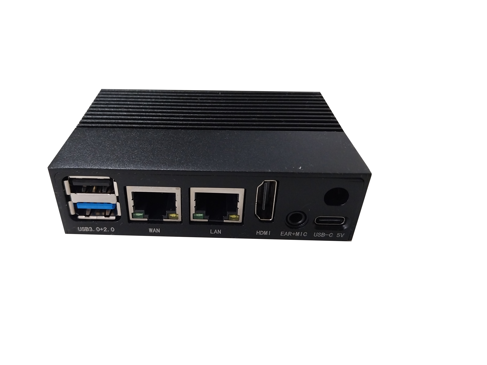

# Botnana BN-B3A

霸那控制器 (Botnana Control) 支援霸那  BN-B3A。

霸那 BN-B3A 規格如下：

* AM3357 800MHz ARM Cortex A8
* 512MB DDR3L@400MHz RAM
* 4GB 8-bit eMMC on-board flash storage
* 1x microSD
* NEON floating-point accelerator
* 1x micro USB 2.0 client (USB0) for power and communication
* 1x USB 2.0 host (USB1), TYPE A socket
* 2x Ethernet 10/100MHz
* Power Consumption: 3.6W
* BN-A2A Dimension: 100.2 x 56.2 x 15 mm
* BN-B2A Dimension: 105.0 x 60.0 x 31.2 mm 

**BN-B3A**

