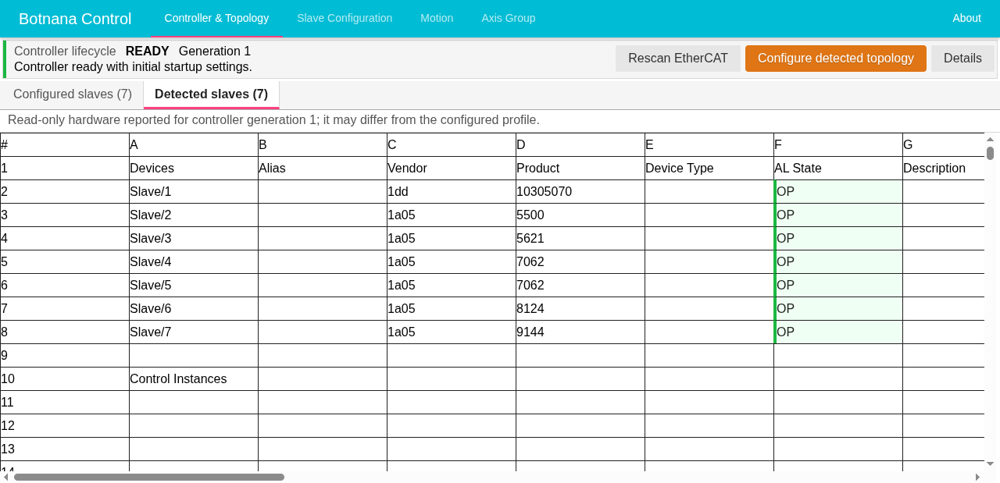
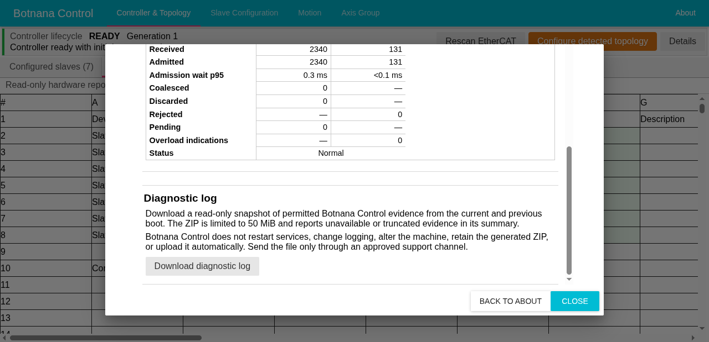
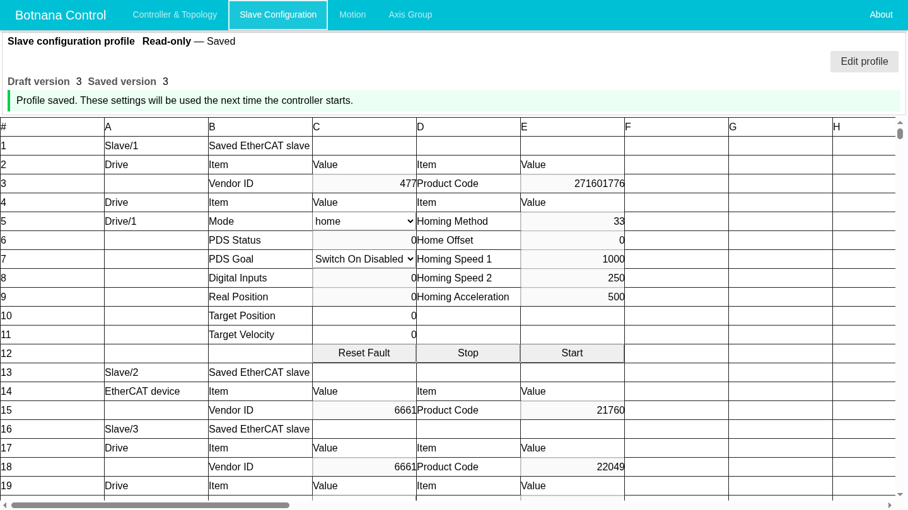

## Botnana Control 入門

Botnana BN-B3A 預設於開機時自動啟動動程科技的 Botnana Control P2P 軸控軟體。

### 開啟 HMI

將上位電腦連接至 BN-B3A 控制網路，然後使用瀏覽器連上
[http://192.168.7.2:3000](http://192.168.7.2:3000)。如果控制器使用其他已設定的
位址，請改用該位址。

請等待 HMI 連線並顯示目前的控制器生命週期。不要因為頁面已開啟，就認為 EtherCAT
控制器已經就緒。下列範例顯示 **Controller & Topology** 工作區內的 **Ready**
控制器。

### 選擇工作區

請使用 HMI 上方的主要導覽列。只切換工作區不會改變已儲存設定或運作中的控制器。

| 導覽項目 | 用途 |
|---|---|
| **Controller & Topology** | 檢查控制器生命週期及啟動進度；比較已設定、已偵測及提案中的 EtherCAT 拓撲；並在適當時執行一般重新掃描、復原或引導式拓撲檢查。 |
| **Slave Configuration** | 檢查已設定的 EtherCAT 從站身分；編輯支援的驅動器、I/O、通道及裝置專用設定。只有控制器狀態允許時，才能使用即時控制。 |
| **Motion** | 檢查或編輯控制週期、軸及軸組容量，以及 EtherCAT 啟動重試時間等整體運動控制設定。 |
| **Axis Group** | 檢查或編輯軸設定、驅動器及編碼器對應，以及軸組映射及限制。 |
| **About** | 檢查 Botnana Control 版本及目前 IP 位址；開啟 **Support diagnostics**；管理核准的軟體更新、IP 位址變更、重新啟動及關機操作。 |

**Slave Configuration**、**Motion** 及 **Axis Group** 是同一份共用設定草稿的不同
檢視。開始另一項獨佔設定或維護操作前，請先儲存或捨棄目前的編輯。

### 實體從站 AL State 狀態與開機診斷

在 **Controller & Topology** 工作區的 **Detected Slaves (偵測從站)** 表格中，系統提供各從站的即時 Application Layer (AL) 通訊狀態：

* **AL State 欄位**：
  * `OP`（綠色標示）：表示從站處於正常運作狀態 (Operational)，週期性資料 (PDO) 正常交換中。
  * `SAFEOP` / `PREOP` / `INIT`（紅色/警示標示）：表示該從站尚未進入 OP，常見於接線鬆脫、硬體設定不符或馬達驅動器報警。
* **開機逾時明確歸因**：
  若開機期間從站未能在時限內全數進入 OP，系統不再只回報模糊的啟動失敗，而是直接指認未進入 OP 的具體從站位置（例如：`slaves not in OP: Slave 8 (PREOP)`），讓工程師無需接上分析儀器即可快速排除異常硬體。
* **未配置機器導引 (Uncommissioned Configuration)**：
  當新機台或更換新控制器開機時，若偵測到實體從站但 `/etc/botnana-control/motion.toml` 內無任何已配置從站 (`configured_slaves == 0`)，HMI 上方會出現清晰的提示橫幅：
  > **Uncommissioned Configuration:** 14 physical EtherCAT slaves detected, but no slaves are configured in motion.toml. Adopt detected topology or upload a configuration to commission this machine.
  此提示明確告知機器處於等待初始試車狀態，而非設定遺失。操作人員可點選 **Adopt detected topology** 一鍵採用掃描結果，或透過 **About** 上傳既有設定檔。

### 連線狀態與下載支援診斷資料

在 **About** 頁面點選 **Open support diagnostics**，可開啟系統連線與診斷介面：

1. **連線活動檢視**：
   - 顯示目前已連線的 Web HMI 瀏覽器與客戶端應用程式連線狀態。
   - 監測即時資料輪詢 (Poll) 與控制命令 (Ordered) 的連線頻率與健康度，確保上位程式與控制器通訊順暢。
2. **下載支援診斷日誌 (Download diagnostic log)**：
   - 當現場試車遇到疑難問題需動程科技工程團隊協助時，點選 **Download diagnostic log** 按鈕。
   - 瀏覽器將自動下載打包好的 `botnana-support-*.zip` 檔案（內含控制器版本、服務運作狀態及系統日誌，上限 50 MiB）。
   - 日誌已自動過濾私密憑證與機台座標資料，可安心透過電子郵件或技術支援管道提供給動程工程師進行分析。

### 機台設定備份與災難復原

Botnana Control 支援機台設定檔的直接匯出與匯入：
* **匯出備份**：在 **About** 頁面或設定工具列中，點選 **Download configuration**，即可將現有的 `/etc/botnana-control/motion.toml` 下載保存至電腦。
* **上傳復原**：在更換控制器硬體或災難復原時，點選 **Upload configuration** 並選擇先前備份的 `.toml` 檔案，經安全性確認後系統將自動寫入並重啟生效。即使在控制器尚未連線的離線頁面上，亦可直接使用復原上傳功能。

### 檢查及編輯從站設定

開啟 **Slave Configuration**，檢查已儲存的 EtherCAT 從站及其支援的裝置設定。此
工作區顯示已儲存設定，不是新的實體掃描。如果需要變更實體順序、身分或別名，請
使用[拓撲檢查程序](./ethercat-topology-maintenance.md)。

此工作區內各類資料列的作用不同：

| 資料列類型 | 範例 | 行為 |
|---|---|---|
| 已儲存身分 | 從站位置、說明、供應商 ID 及產品代碼 | 識別已儲存設定中的從站。即使在設定編輯模式下，供應商 ID 及產品代碼仍為唯讀。實體身分或別名變更須經由拓撲程序檢查。 |
| 設定項目 | 原點復歸方法、偏移、速度、加速度，以及支援的 I/O 或通道設定 | 只有在設定編輯模式下才能編輯。經確認的編輯只會改變共用草稿，不會改變運作中的控制器。 |
| 即時狀態 | PDS 狀態、數位輸入、實際位置及裝置狀態計數器 | 控制器運作狀態的唯讀觀察資料。 |
| 即時控制 | 運作模式、PDS 目標、目標值、**Reset Fault**、**Stop** 及 **Start** | 可用時會作用於運作中的控制器，不是已儲存設定的編輯。 |

> **警告：**頁首的 **Read-only** 及 **Editing** 描述的是已儲存設定。這些狀態不會
> 使機台進入安全狀態，也不會將即時控制轉為設定項目。只有在 **Controller &
> Topology** 顯示 **Ready**，且機台處於現場核准的安全狀態時，才能使用即時控制。

若要編輯已儲存的從站設定：

1. 使用一個瀏覽器工作階段作為目前的設定編輯者。先與其他 HMI 使用者協調，並確認
   畫面顯示的已儲存從站是預定設定。
2. 選擇 **Edit profile**。可編輯的設定儲存格會開放使用；即時狀態及即時控制仍有
   各自獨立的作用。
3. 變更需要的設定儲存格，然後等待 HMI 顯示新的草稿版本及未儲存變更數量。
4. 選擇 **Review changes**。逐列檢查設定項目、已儲存值、未儲存值及所屬畫面。

   

5. 選擇一項操作：
   - **Save changes**：儲存整份共用草稿，供控制器下次啟動時使用；不會取代運作中
     控制器的設定。
   - **Discard changes**：捨棄整份共用草稿，並恢復已儲存設定。
6. 沒有未儲存變更後，選擇 **Finish editing** 回到唯讀模式。**Finish editing** 不會
   儲存任何資料。

儲存及捨棄會作用於整份共用草稿，不只限於 **Slave Configuration** 畫面上可見的
資料列。如果 **Review changes** 列出其他畫面的編輯，請先與該項編輯的負責人協調。
如果編輯或儲存時回報設定已由其他工作階段變更，請檢查重新整理後的值，不要直接
重複操作。

### 檢查及編輯 Motion 設定

開啟 **Motion**，比較運作中控制器使用的整體運動控制值與共用設定中的值。

兩個數值欄位具有不同的生命週期：

- **Active controller** 顯示目前控制器世代啟動時選用的值。儲存設定不會改變此欄。
- **Configuration** 在唯讀模式顯示已儲存設定，在編輯模式則顯示共用草稿。截圖刻意
  顯示與作用中控制器不同的已儲存值；這些是範例值，不是預設值。

Motion 各列的作用如下：

| 設定 | 意義 |
|---|---|
| `period_us` | 即時運動控制週期，單位為微秒。週期越短，所需處理頻率越高。 |
| `group_capacity` | **Axis Group** 中可用的軸組設定數量。 |
| `axis_capacity` | **Axis Group** 中可用的軸設定數量，也是軸組映射可使用的軸編號上限。 |
| `boot_retry_window_ms` | 控制器啟動期間，重試取得可用 EtherCAT 主站的時間範圍，單位為毫秒；不是完整的就緒期限。 |

請使用從站設定一節所述的同一套 **Edit profile**、**Review changes**、**Save
changes** 及 **Discard changes** 程序。不要開始第二個編輯工作階段，也不要試圖只
儲存共用草稿的一部分。

> **重要：**儲存 Motion 設定只會準備供之後的控制器啟動使用，不會套用至運作中的
> 控制器。一般 **Rescan EtherCAT** 會使用上次正常運作設定，不會使用剛儲存的設定
> 值。任何受控重新啟動都應依現場試車程序規劃；啟動後先確認 **Ready** 及 **Active
> controller** 回讀，再啟用運動控制。

### 檢查及編輯軸與軸組設定

開啟 **Axis Group**，比較作用中的軸與軸組值及其設定值。**Motion** 中設定的容量會
決定此工作區顯示多少個 `Group/N` 及 `Axis/N` 區段。

此工作區依責任區分設定：

| 區段 | 設定 |
|---|---|
| 軸組識別 | `name` 及 `type`；支援的軸組類型包括 `1D`、`2D`、`3D` 及 `SINE`。 |
| 軸組映射 | `mapping` 列出軸組協調且從 1 起算的軸編號；編號數量必須符合軸組類型。 |
| 軸組限制 | `vmax`、`amax`、`jmax` 及 `ignorable_distance` 依設定的工程單位定義軸組指令及完成判定限制。 |
| 軸回授 | 原點偏移、編碼器比例與方向、選用的外部編碼器設定，以及閉迴路設定。 |
| 軸限制及調整 | 軸速度及加速度限制、可忽略距離、位置偏差限制，以及前饋值。 |
| 裝置指派 | 驅動器及外部編碼器的別名、從站位置及通道。這些指派參照已儲存拓撲，不會變更 EtherCAT 供應商或產品身分。 |

軸與軸組的編輯使用同一份共用設定程序；儲存前，應逐項檢查待處理變更所顯示的
**Screen**。如果在同一份草稿同時變更 Motion 容量及 Axis Group 內容，應依設定的
軸數量重新檢查每項映射。

> **警告：**錯誤的比例、方向、映射、限制或裝置指派可能造成非預期運動，或使回授
> 失效。試車時應停用運動控制，並讓機台保持在現場核准的安全狀態。受控啟動控制器
> 後，請先確認裝置指派、方向、比例及限制，再啟用運動控制。

### 分開看待觀察、設定及運作狀態

HMI 會刻意分開管理下列狀態：

- **偵測拓撲（Detected topology）**是最新一次完整 EtherCAT 實體掃描所得的
  唯讀證據。掃描不會儲存或採用該拓撲。
- **共用草稿（Shared draft）**包含目前在設定工作區檢查的設定。尚未儲存的草稿
  變更不會持久保存。
- **已儲存設定（Saved profile）**是持久儲存在控制器上的設定。
- **運作中的控制器（Running controller）**使用成功啟動時的設定。儲存設定不會
  在未告知的情況下取代目前運作中的設定。

一般 **Rescan EtherCAT** 會使用 **Last working settings** 重建控制器，不會使用
尚未儲存的編輯。控制器無法使用時，**Start controller** 會使用檢查過的已儲存
設定。核准的實體拓撲變更則使用專用檢查及 **Approve, save, and start** 程序。

使用動作控制或即時 EtherCAT 控制前，請等待 **Controller & Topology** 顯示
**Ready**。控制器無法使用、正在啟動或回報故障時，請讓機台保持在現場核准的安全
狀態；HMI 指令是維護控制，不是安全連鎖。

### 依需求繼續操作

- 如果 **Controller & Topology** 顯示 **Controller unavailable**，或需要執行一般
  重新掃描，請依照 [EtherCAT 控制器復原](./ethercat-controller-recovery.md)。
- 如果是核准的實體新增、移除、更換或重新排序，請依照
  [檢查並設定 EtherCAT 拓撲](./ethercat-topology-maintenance.md)。
- 如果要安裝套件或回復舊版本，請參閱[軟體更新](./update-software.md)。
- 如果要變更控制器 IP 位址，請參閱
  [USB 連線 IP 設定](./faq/gadget.md)。
- 如果設定是在 HMI 外維護，請參閱[設定檔](./configuration-file.md)。
