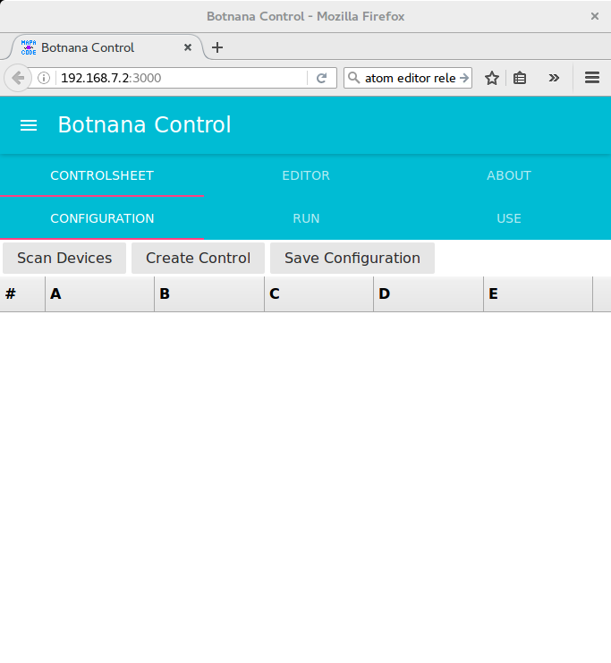

## Botnana Control 入門

Botnana A2 預設於開機時自動啟動動程科技的 Botnana Control P2P 軸控軟體。此一軸控軟體安裝於 `/opt/mapacode/botnana-control`。

因此，使用瀏覽器連上 http://192.168.7.2:3000 。可見到以下畫面。

如果 Botnana A2 上未安裝 Botnana Control P2P，可以以下列方式安裝：

    dpkg -i botnana-control_0.0.1-1_armhf.deb

解安裝請執行

    dpkg -r botnana-control

若要用 etherCAT Master RTDM ，且不用 Botnana Control P2P 軸控軟體，則需自行設定如下︰ 

    1. 執行 dpkg -r botnana-control
    2. 於檔案 /etc/rc.local 中，確認有如下的註解行(3.14.26 會因 kernel 版本而異)
       #insmod /lib/modules/3.14.26/kernel/drivers/net/ethernet/ti/ti_cpsw.ko
    3. 執行 insserv ethercat

### Configuration

請參考 [設定檔](./configuration-file.md) 章節，若無必要，請勿手動修改設定檔。
