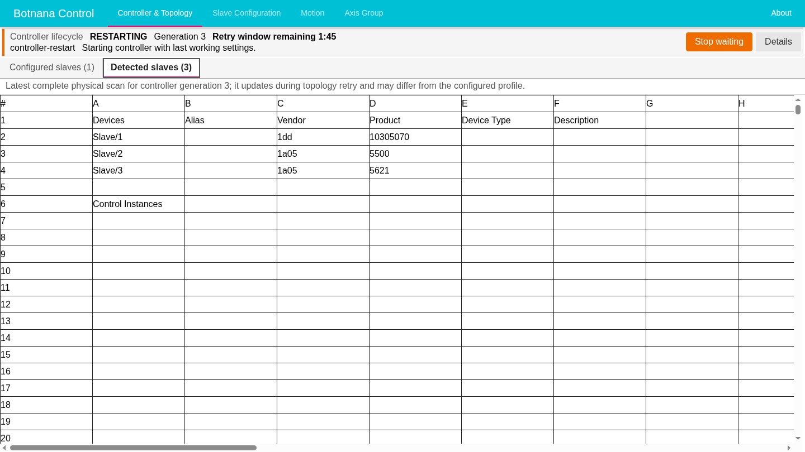

# EtherCAT 控制器復原

當 Botnana Control 必須重新偵測已連接的 EtherCAT 硬體，或 **Controller &
Topology** 顯示 **Controller unavailable** 時，請使用本程序。如果是核准的新增、
移除、更換或重新排序，請改用 [檢查並設定 EtherCAT 拓撲](ethercat-topology-maintenance.md)。

> **安全注意事項：**重新掃描、啟動或重新啟動控制器之前，請依現場核准的程序讓
> 機台進入安全停止狀態。這些 HMI 操作是維護控制，不是安全功能。控制器無法使用
> 或正在啟動時，動作控制、指令稿及即時 EtherCAT 控制都無法使用。

## 瞭解控制器狀態

HMI 會分開管理下列狀態：

- **草稿設定（draft profile）**是 HMI 目前顯示、尚在編輯的內容。
- **已儲存設定（saved profile）**是持久保存的設定，也是 **Start controller**
  使用的設定。
- **Last working settings** 是上一次正常運作控制器所保留的設定，一般重新掃描會
  使用這份設定。
- **運作中的控制器（running controller）**是目前啟用的 EtherCAT 控制器。儲存
  設定不會啟動控制器；啟動控制器也不會自動儲存啟動時偵測到的硬體。

請依目前畫面選擇操作：

| HMI 狀態 | 操作 |
|---|---|
| 控制器已就緒且可使用 **Rescan EtherCAT** | 執行一般重新掃描。 |
| 生命週期為 **failed**、**Details** 內的標題為 **Controller unavailable**，且可使用 **Start controller** | 檢查已儲存設定，再啟動控制器。命令列也可能顯示 Last working settings 啟動嘗試失敗。 |
| 因設定有未儲存變更而無法使用 **Start controller** | 儲存預定的變更或將其捨棄，然後重新檢查已儲存設定。 |
| 控制器啟動（包括初始開機）正在重試拓撲驗證，且命令列提供 **Stop waiting** | 繼續等待，或停止已無助益的拓撲等待。不必開啟 **Details** 即可找到此操作。 |
| 啟動進行中，但沒有 **Stop waiting** | 等待成功或失敗；不要送出另一項要求。初始啟動可能尚未到達可停止的拓撲重試閘門，或目前階段已不再允許停止。 |
| **Start controller** 已停用，且 HMI 顯示 **Start controller is unavailable until authoritative recovery status is available.** | 等待 HMI 重新連線並顯示最新的權威狀態。 |
| HMI 要求重新啟動 **Botnana Control 運動控制服務（`bnc-motion`）** | 這是在 BN-B3A 上執行的控制器服務，不是 EtherCAT 從站。請由獲授權的管理員依照[清理失敗時](#清理失敗時)處理。 |

## 重新掃描已就緒的控制器

一般重新掃描會使用 **Last working settings** 重建運作中的控制器，不會套用尚未
儲存的設定變更。

1. 確認機台已進入現場核准的安全狀態。
2. 開啟 **Controller & Topology**。
3. 選擇 **Rescan EtherCAT**。
4. 觀察畫面顯示的啟動階段及拓撲重試倒數。拓撲重試期間，**Detected slaves**
   會在每次完成完整實體掃描後更新，因此可以立即看見新增、移除、更換或重新排序
   的從站。
5. 將 **Detected slaves** 和預定的實體串列逐一比較。顯示變更後的掃描結果不代表
   已儲存或採用該拓撲。
6. 如果出現 **Stop waiting**，而且繼續重試已無助益，請依照
   [停止拓撲等待](#停止拓撲等待)處理；否則繼續等待。
7. 控制器顯示 **Ready** 後，確認所有預期的 EtherCAT 從站都已出現，並在恢復
   操作前確認機台狀態。

下列重試已觀察到三個實體從站，但已儲存拓撲仍只有一個從站。此時可以使用 **Stop
waiting**，但 detected 資料列仍只是觀察結果，尚未被採用：



如果命令列顯示 **Controller start with last working settings failed**，表示控制器目前
無法使用。選擇 **Details** 會開啟標題為 **Controller unavailable** 的抽屜；接著請
執行[復原無法使用的控制器](#復原無法使用的控制器)。

## 停止拓撲等待

當初始開機或操作員要求的控制器啟動正在重試 EtherCAT 拓撲驗證，而且控制器回報
該嘗試可以停止時，**Controller & Topology** 命令列會提供 **Stop waiting**。這是協同式
停止，不是回復、強制停止或緊急停止。先前的控制器已經拆除；停止等待後，控制器
仍然無法使用。

1. 讓機台保持在現場核准的安全狀態。
2. 檢查畫面顯示的控制器世代（generation）及設定來源：開機應顯示 **Initial
   startup settings**；一般重新掃描應顯示 **Last working settings**；復原程序則應
   顯示 **Saved profile**。
3. 選擇 **Stop waiting**。
4. 在確認畫面再次核對相同的世代及設定來源。替代控制器嘗試會警告無法恢復先前
   控制器；初始開機則沒有先前控制器。只有在確定要讓控制器維持無法使用時才確認。
5. 畫面顯示 **Stopping controller start…** 時，等待正在進行的 EtherCAT 掃描
   返回。此要求不會強制終止掃描，也不保證最長完成時間。
6. 等到 HMI 報告啟動已停止並顯示 **Controller unavailable** 後才能繼續。
7. 修正已連接硬體或已儲存設定。如果實體差異是核准的配置變更，請進入
   [檢查並設定 EtherCAT 拓撲](ethercat-topology-maintenance.md)；否則再次啟動控制器。
   確認從站及機台狀態。

停止等待不會儲存或捨棄變更、不會更改已儲存設定或 Last working settings，也不會
採用偵測到的硬體。如果 **Stop waiting** 消失或要求遭拒，請以重新整理後的狀態為
準；不要自行認定啟動已停止。

## 復原無法使用的控制器

**Start controller** 一律使用已儲存設定。

1. 在 **Controller & Topology** 選擇 **Details**，確認抽屜標題為
   **Controller unavailable**，並讀取失敗原因及嘗試階段。
2. 檢查已儲存設定的版本，以及它是否和 **Last working settings** 不同。
3. 如果需要修正，開啟 **Edit in** 欄位所指示的設定畫面，選擇 **Edit profile**
   並進行修改。
4. 檢查所有未儲存變更，然後選擇一項操作：
   - **Save changes**：讓草稿成為下次啟動使用的已儲存設定。
   - **Discard changes**：恢復已儲存設定；此操作不會恢復 Last working settings，
     也不會啟動控制器。
5. 返回 **Controller & Topology**，確認畫面顯示預定使用的已儲存設定版本。
6. 選擇 **Start controller**。
7. 等待驗證、清理、替代控制器啟動及可能發生的拓撲重試。如果出現 **Stop
   waiting**，而且重試已無助益，請依照前述停止程序處理。
8. 控制器顯示 **Ready** 後，確認預期的 EtherCAT 從站及機台狀態，再恢復操作。

如果 **Save changes** 失敗，變更仍處於未儲存狀態。請修正畫面回報的問題，然後
選擇 **Retry save**。HMI 確認儲存成功之前，不可將這些變更視為已持久保存。

另一個瀏覽器工作階段可能在您檢查設定時修改設定。此時 Botnana Control 會拒絕
過期的編輯、儲存、捨棄或啟動要求。再次操作前，請檢查重新整理後的設定及修訂版
號。

## 復原期間重新連線

瀏覽器中斷連線不會取消重新掃描、停止要求或控制器啟動。重新連線後，請先檢查
恢復顯示的控制器世代、設定來源、階段、停止狀態及結果，再進行其他操作。

如果 HMI 持續停在 **Stopping controller start…**，請記錄可供支援人員使用的
資訊並升級處理，不要自行認定要求已完成。

## 清理失敗時

`bnc-motion` 是在 BN-B3A 上執行的 **Botnana Control 運動控制服務**。它承載
EtherCAT 控制器執行期；不是 EtherCAT 從站、驅動器或馬達。重新啟動它會中斷
控制器連線，屬於獲授權管理員的處理動作，不是一般操作員控制項。

清理程序會停止故障控制器剩餘的工作，並在建立替代控制器之前釋放其執行期連線。
如果清理失敗，在相同 `bnc-motion` 程序中再次啟動並不安全。HMI 會停用
**Start controller**，並指示管理員重新啟動此服務。

1. 不要再送出啟動或重新掃描要求。
2. 記錄控制器世代、失敗原因、嘗試階段及結果。
3. 儲存重新啟動後仍須保留的設定變更，或捨棄不需要的變更。如果無法儲存，請先
   記錄必要的未儲存數值，因為重新啟動服務可能使其遺失。
4. 確認機台仍處於現場核准的安全狀態。
5. 請獲授權的管理員執行：

   ```bash
   sudo systemctl restart bnc-motion
   ```

6. 等待 HMI 重新連線並顯示最新狀態。
7. 再次檢查已儲存設定。如果控制器已就緒，請確認從站及機台狀態；如果控制器無法
   使用且 **Start controller** 已啟用，請重新執行復原程序。
8. 如果清理或服務啟動再次失敗，請停止並聯絡支援人員，不要反覆重新啟動服務。

重新啟動 `bnc-motion` 不會刪除已儲存設定。未儲存變更不是復原來源，不應預期它們
會在重新啟動後保留。

成功清理後發生的啟動失敗並不相同：此時可能再次出現 **Start controller**，因為
系統仍能安全釋放失敗的替代控制器。只有在 HMI 啟用此操作時才能重試。如果 HMI
要求重新啟動服務，請改用清理失敗程序。

## 收集有限拓撲追蹤記錄

Botnana Control 1.14.4 套件修訂版 19 以上會在 `bnc-motion` journal 寫入精簡的
`topology.trace` 記錄。重新啟動服務或變更設定前，請先收集：

```bash
sudo journalctl -u bnc-motion -n 300 --no-pager
```

請使用控制器世代（generation）串聯核准、預期的已儲存拓撲、發生變化的實體觀察
結果、最終比較，以及 Ready、failed 或 cancelled 結果。精簡身分使用十六進位
`position:vendor_id:product_code` 格式。重試期間未變的掃描會遭抑制，因此不會每
500 毫秒寫入一筆相同記錄。追蹤不包含裝置設定、指令稿或其他設定內容。

針對 HMI 回報的確切不符情況，請保留下列記錄：

- `event=topology.approval`；
- `event=controller.start`；
- `event=topology.observed`；
- `event=topology.verification`；以及
- `event=controller.start.completed`。

不要只為了收集這項有限追蹤而啟用高流量 EtherCAT frame logging。

## 提供支援人員的資訊

請記錄：

- 失敗時間；
- 控制器世代；
- 失敗原因、嘗試階段及結果；
- 是否曾要求 **Stop waiting**，以及 HMI 是否顯示已停止的結果；
- 已儲存設定版本，以及當時是否有未儲存變更；
- 預期及實際觀察到的 EtherCAT 從站；以及
- 經過一次獲授權的 `bnc-motion` 服務重新啟動後，問題是否再次發生。

請將這些資訊保存在現場事件記錄中。不要將 EtherCAT 寫入指令當成疑難排解捷徑。
