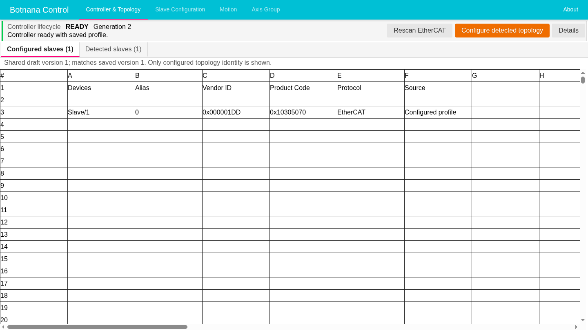
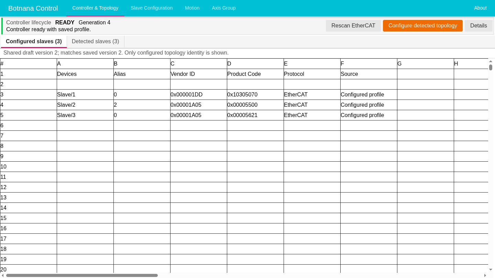

# 檢查並設定 EtherCAT 拓撲

當獲授權的試車技術人員要刻意新增、移除、更換或重新排序 EtherCAT 從站時，請使用
引導式拓撲檢查。如果硬體配置不應改變，請使用一般 **Rescan EtherCAT**。如果故障不是由
核准的配置變更造成，請使用 [EtherCAT 控制器復原](ethercat-controller-recovery.md)。

掃描已連接硬體不會儲存或採用硬體。只有明確使用完整掃描建立提案、檢查影響、
儲存、從該確切已儲存版本啟動，而且控制器到達 **Ready** 後，變更的配置才會生效。

> **安全注意事項：**請遵守現場的上鎖、動作停用、電氣隔離及驗證程序。HMI 確認
> 只記錄您對機台已安全的聲明，不是安全連鎖。控制器無法使用、正在啟動或回報故障
> 時，請讓機台保持在核准的安全狀態。

## 瞭解拓撲狀態

**Controller & Topology** 會分開管理實體觀察結果、提議的編輯、已儲存設定及運作中
的控制器：

| HMI 狀態 | 意義 |
|---|---|
| **Configured slaves** | 檢查期間用作已儲存比較基準的唯讀拓撲。 |
| **Detected slaves** | 最新一次成功更新掃描所得的唯讀硬體。一般啟動或重新掃描期間，則會跟隨每次最新完成的實體啟動掃描。 |
| **Proposed topology** | 選擇 **Configure detected topology** 後，由完整更新掃描自動建立的提案。此處只能編輯 **Expected Alias**。 |
| **Shared draft** 及 **Draft version** | 正在檢查的設定，尚未儲存供啟動使用。 |
| **Saved profile** 及 **Saved version** | 持久儲存在控制器上的設定。 |
| **Running controller** | 目前控制機台的設定；只有儲存不會改變它。 |
| **Previous controller settings** | 取消檢查時，用來恢復控制器的確切保留設定。 |

各頁籤的數量可用來交叉檢查。Configured 與 Detected 數量不同本身不會造成任何
變更。檢查期間，先前的偵測資料列會標示 **Before configuration** 及 **Reference only**，
直到更新掃描完成後才由目前結果取代。

請在 **Slave Configuration** 檢查驅動器、I/O、通道及其他從站類型設定。切換
**Controller & Topology** 頁籤不會取代該編輯器。

## 準備變更

開始拓撲檢查前：

1. 記錄核准的實體變更、目前從站順序、別名、vendor ID、product code 及回復計畫。
   必要時拍攝標籤及配線。
2. 確認步驟 1 的回復計畫確實可行：如果變更後的拓撲無法到達 **Ready**，可以將
   原本的從站、實體排列順序及配線恢復成變更前的狀態。
3. 在 **Controller & Topology** 比較 **Configured slaves** 和 **Detected slaves**。
4. 拓撲檢查會以已儲存設定作為比較及回復基準。請儲存必須保留的現有編輯，或捨棄
   不需要的編輯，直到 HMI 不再顯示 **Unsaved changes**。這可避免將一般設定編輯
   和拓撲變更混在同一次檢查程序中。
5. 停止正在使用控制器的指令稿、配方、HMI 工作及其他作業。
6. 讓機台進入現場核准的安全狀態；依規定隔離裝置電源、完成核准的實體變更、檢查
   配線及順序，而且只有在允許時才能恢復電源。
7. 只有在可使用 **Configure detected topology**，且附近沒有顯示未解決原因時才繼續。

控制器可以是 **Ready**；如果刻意改變的實體配置已經和乾淨的已儲存設定不同，
控制器也可能是 **Failed**。下列範例在新增兩個核准從站前，乾淨的已儲存基準包含
一個從站：

## 開始引導式設定

1. 選擇 **Configure detected topology**。
2. 閱讀確認內容；只有在機台已安全時才確認。
3. 等待 Botnana Control 釋放控制器世代及 EtherCAT master、執行更新掃描，並自動
   建立完整提案。不要重複送出要求。
4. 更新掃描尚未完成時，**Detected slaves** 會保留先前資料列，並標示 **Before
   configuration** 及 **Reference only**。
5. 確認 **Proposed topology** 自動開啟並顯示確切更新掃描。沒有個別的檢查或重新
   掃描操作。

此時控制器無法使用是正常狀態。開始檢查不會改變草稿版本或已儲存版本。一般設定
編輯器仍可看見，但偵測拓撲檢查期間會停用。

下列結果提案包含完整的三從站掃描。頁籤數量會持續分別顯示 configured、detected
及 proposed 來源，而提案只開放編輯 **Expected Alias**：

如果進入要求遭拒，請讀取畫面原因，不要繞過限制。原因可能是控制器工作尚未完成、
正在轉換狀態、有未儲存設定、已有另一項獨佔拓撲作業，或執行期資源無法安全釋放。

## 檢查並編輯完整提案

1. 確認提案中的每個位置、vendor ID 及 product code 都是預定項目。不能只採用
   部分拓撲。
2. 必要時直接在試算表編輯 **Expected Alias**，只能輸入 0 至 65535 的整數。這可能
   重新定位參照；不會寫入實體從站 EEPROM。
3. 檢查畫面所列的每一項清除、預設、移動、保留及別名影響。
4. 確認畫面只有 **Cancel** 與 **Approve, save, and start** 兩個操作按鈕。

如果任何資料列或影響不符合預期，請選擇 **Cancel**、修正硬體或計畫，再從
**Configure detected topology** 重新開始。

常見影響如下：

| 變更 | 必須檢查的內容 |
|---|---|
| 新增從站 | 只會建立最小項目；Botnana Control 不會猜測裝置設定或映射。 |
| 移除從站 | 檢查所有參照該從站的驅動器、軸、群組、I/O 或通道關係。 |
| 唯一裝置移動 | 依身分綁定的參照可能跟著移動，但仍須檢查和位置有關的假設。 |
| 不同型號更換 | 裝置專用設定會清除，不會複製到不同硬體。 |
| 無法區分的相同裝置 | Botnana Control 不會猜測移動關係；無法配對的設定會保守地清除。 |

不要只為了讓儲存按鈕可用而接受清除或預設值。如果影響不是預定結果，請取消、
修正硬體或計畫後重新掃描，或取消並捨棄草稿。

移除最後一個從站可以產生零資料列的有效提案。空的已儲存從站清單會被視為尚未
試車的拓撲；不代表系統會強制禁止日後連接任何從站。

## 核准、儲存並啟動

1. 選擇 **Approve, save, and start**。
2. 確認確切提案拓撲、預期別名及畫面所列影響。
3. 提案頁籤和兩個決策按鈕會立即關閉。Botnana Control 會接受這些影響、儲存該
   確切草稿，並從已儲存版本啟動控制器；不會顯示中間的提案或儲存確認訊息。
4. 只有在控制器顯示 **Ready** 後才能繼續。
5. 恢復動作許可前，確認從站順序、身分、必要裝置設定及機台狀態。

核准及啟動成功後，configured 頁籤會顯示確切的已儲存三從站拓撲，而且控制器會
顯示 **Ready**：

啟動已儲存或先前控制器時，只會顯示一般控制器生命週期進度。如果出現 **Stop
waiting** 並加以確認，該次嘗試會取消、內部檢查工作階段會結束，而且 HMI 會返回
一般的控制器無法使用狀態。系統不會自動重新開啟拓撲檢查，也不會顯示重試／恢復操作。請依
目前狀態明確選擇 **Configure detected topology**、**Start controller** 或修正設定。

## 不採用提案而取消

當提案硬體不應啟用時，請選擇 **Cancel**。確認未核准草稿會遭捨棄，而且會恢復
先前控制器。取消不會改變已儲存設定，也不會採用提案。必要時先恢復相容的實體
硬體，再等待 **Ready** 並確認機台。

## 重新連線及故障處理

內部拓撲檢查工作階段屬於控制器，不屬於單一瀏覽器。重新整理或重新連線後，請等待
**Restoring topology configuration state** 被目前階段取代。繼續前先確認階段、狀態修訂版、草稿及
已儲存版本、偵測快照、提案和檢查結果。如果另一個工作階段已先執行操作，請檢查
重新整理後的狀態，不要重複舊要求。

- **掃描失敗：**舊快照若標示為非目前狀態，不可使用。選擇 **Cancel**，修正電源、
  連線、纜線或偵測狀態，再從 **Configure detected topology** 重新開始。
- **儲存前核准失敗：**提案仍未核准。修正問題後再次核准，或選擇取消。
- **儲存後啟動失敗：**拓撲設定會結束，而且不會重新開啟提案。核准設定仍已儲存。
  請使用一般控制器無法使用流程，並只在允許復原時選擇 **Start controller**。
- **顯示 Service recovery is required：**不要再啟動程序內操作。記錄階段、版本、
  世代及錯誤，請獲授權管理員依照 [EtherCAT 控制器復原](ethercat-controller-recovery.md#清理失敗時)
  中的 `bnc-motion` 程序處理。

向支援人員回報時，請記錄安裝的 Botnana Control 版本、核准變更、變更前後的實體
身分及順序、檢查階段、草稿及已儲存版本、偵測快照、已接受的影響、最終控制器
狀態，以及任何中斷連線、重試或重新啟動服務的時間。
