## USB 連線 IP 設定

新購買的 BN-B3A 的 IP 為 192.168.7.2。因此，建議上位控制器的 IP 設為 192.168.7.1。網路遮罩設為 255.255.255.0 ，如下所示。

1. 開啟設定／網路和網際網路, 選擇進階網路設定中的變更界面卡選項。

    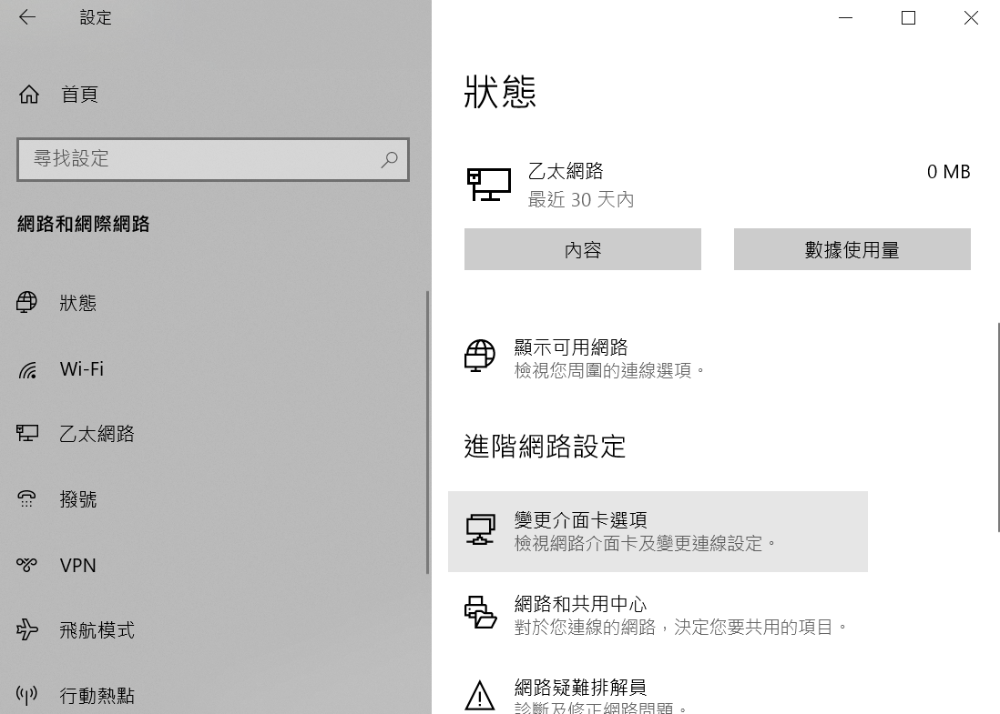

1. 選擇型別為 Remote NDS 或是 RNDIS 的無法辨識的乙太網路。

    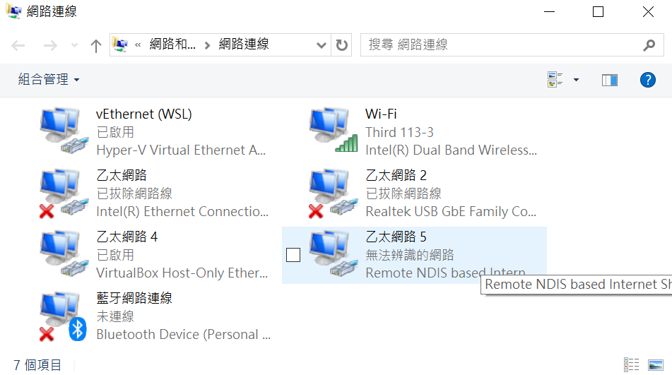

1. 選擇此一網路的內容。

    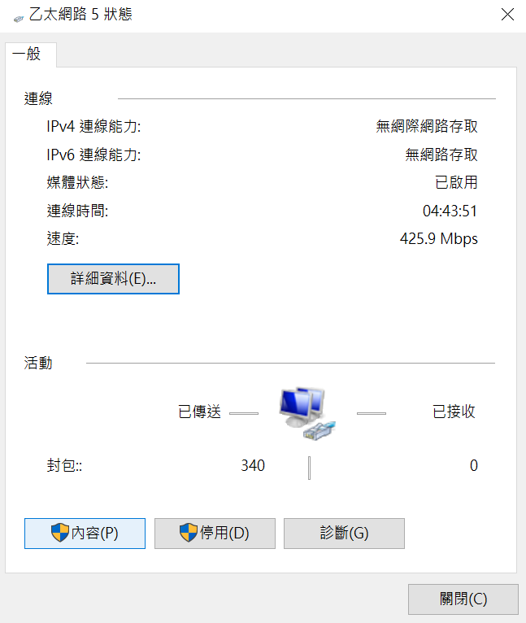

1. 選擇網際網路通訊協定。

    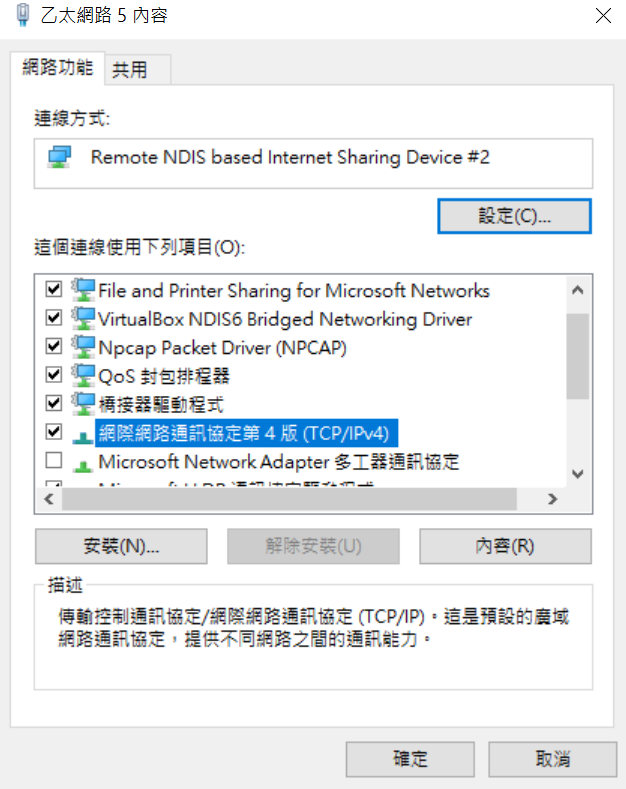

1. 設定 IP 地址和遮罩。

    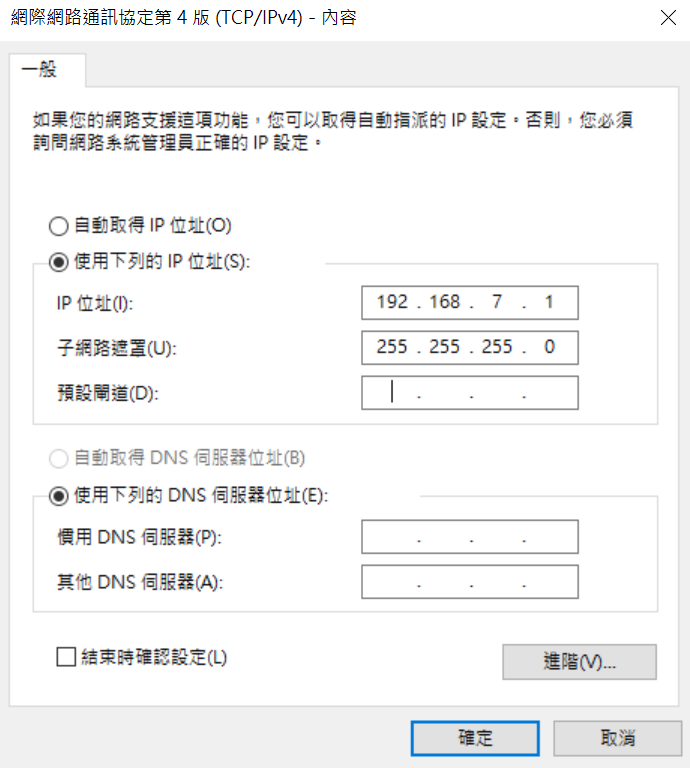

1. 連線測試，使用命令提示字元或是 Power shell，

    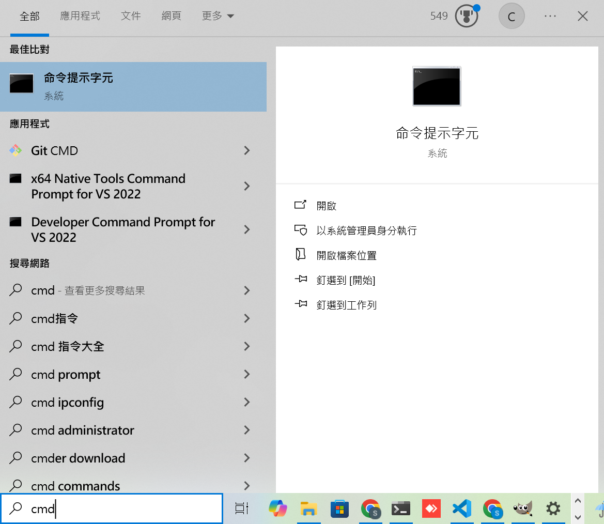

1. 執行 ssh debian@192.168.7.2，debian 為登入帳號。當詢問是否繼續時，回答 yes。

    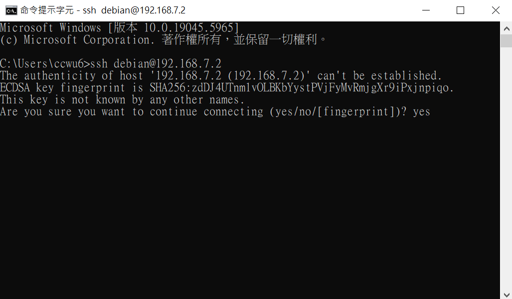

1. 詢問密碼時，回答 temppwd。

    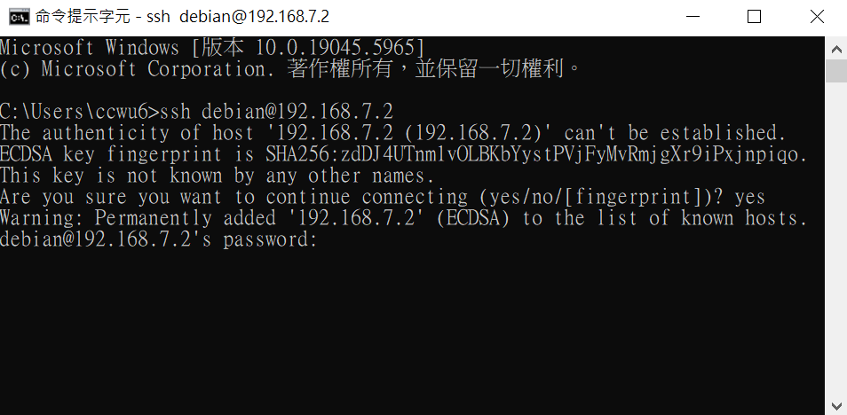

1. 以下為登入內建的 Linux 系統的畫面。

    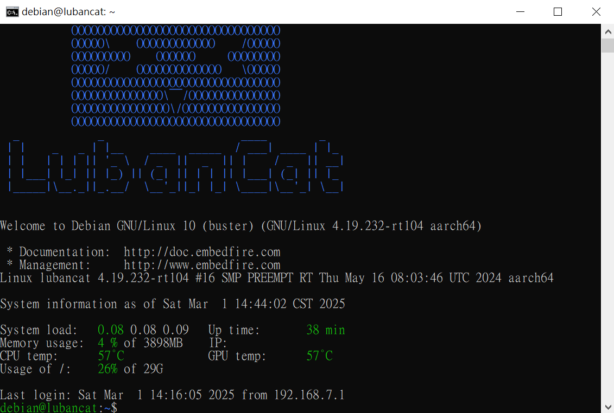

1. 也可以使用瀏覽器連上 http://192.168.7.2:3000 來進行確認。目前 BN-B3A 尚未支援
HTTPS，因此以下網頁會出現紅色不安全警告，可以忽略此警告。

    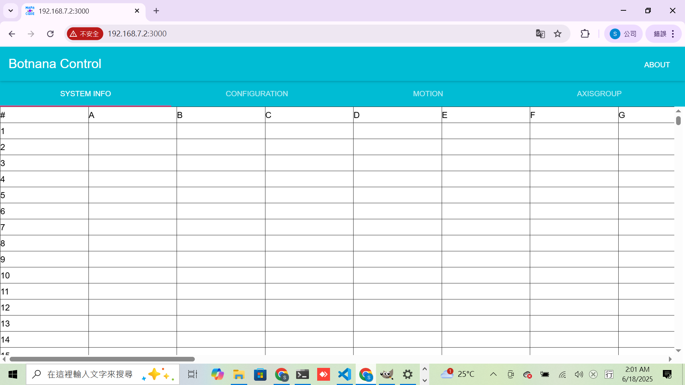

### 修改 IP

如果要修改 IP，比如，想要同時連接兩台 BN-B3A，或是因為和其他裝置衝突而必須修改，請按右上角的 [ABOUT]，然後在 [Set IP] 的左方輸入區輸入想要設定的 IP 的前三碼。比如，要設 IP 為 192.168.6.2，請輸入 192.168.6，如下圖，然後按 [Set IP]，注意在按了 [Set IP] 後，需要 Reboot。同時，還需要將上位電腦的 IP 設定為對應的 IP ，如 192.168.6.1 後，才能連線。

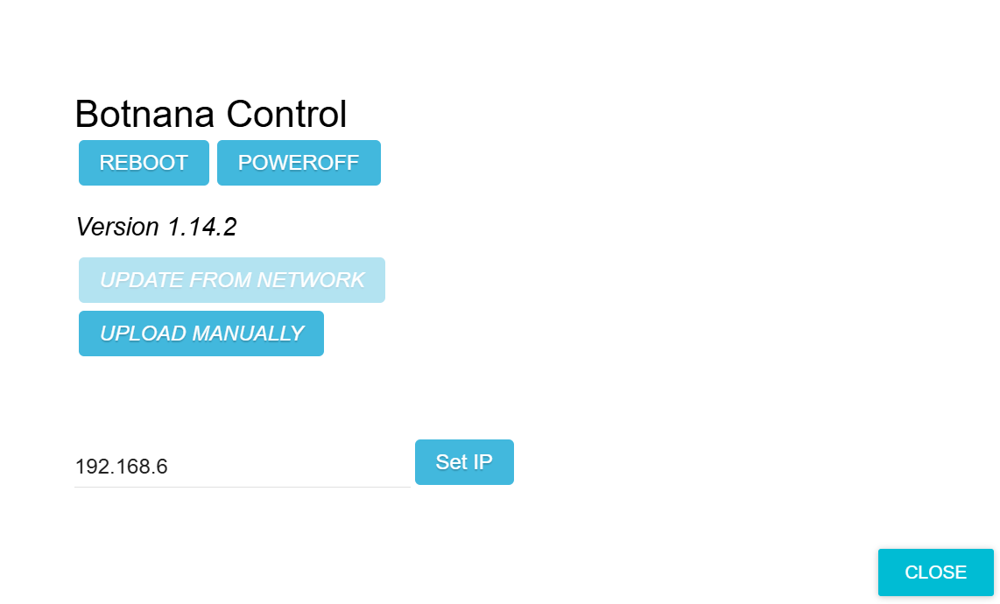

### 同一電腦連接多塊 BN-B3A

修改方式如 **修改 IP** ，但每塊 BN-B3A 要設為不同的 IP 區段。

例如︰
第一塊設為 address 192.168.**6**.2，第二塊設為 address 192.168.**7**.2。