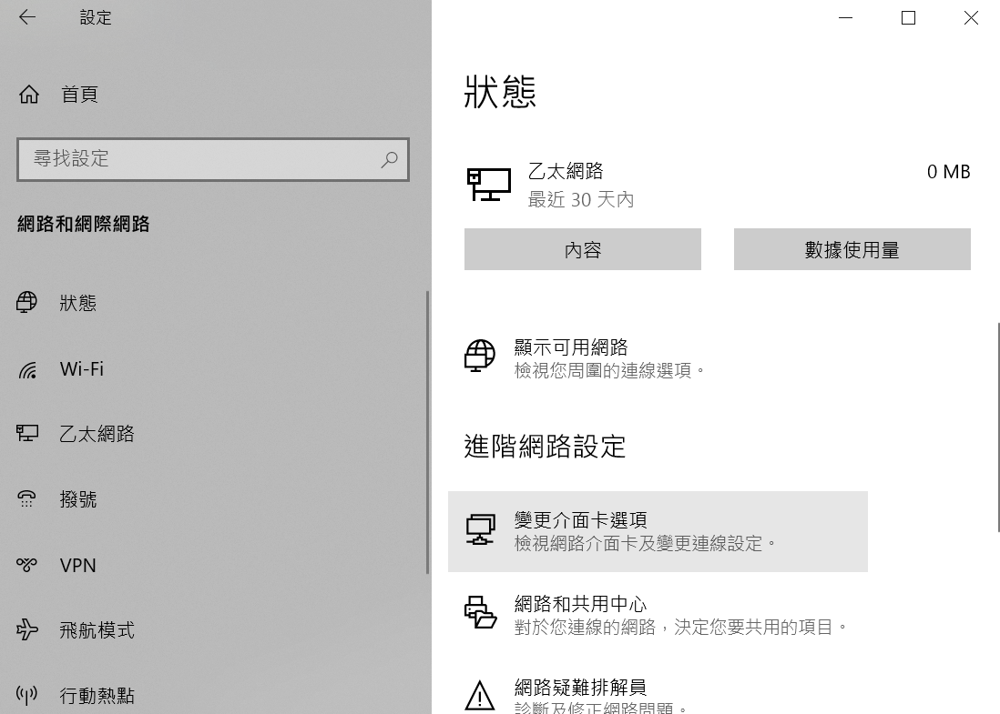
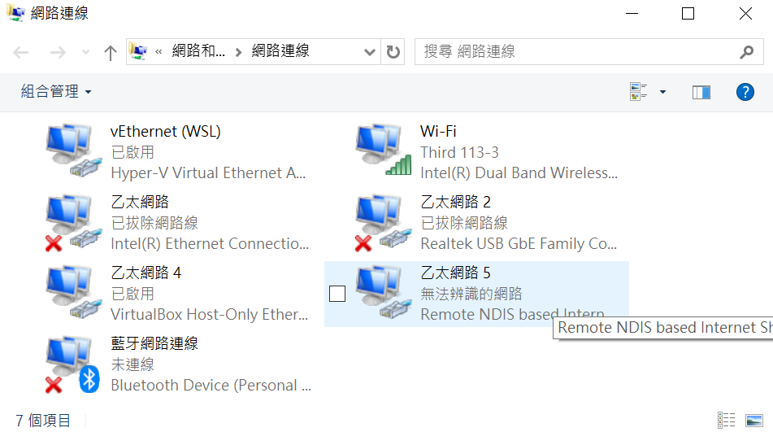
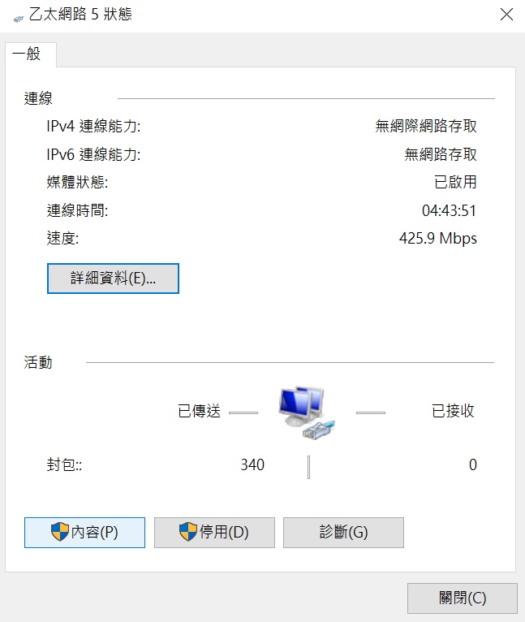
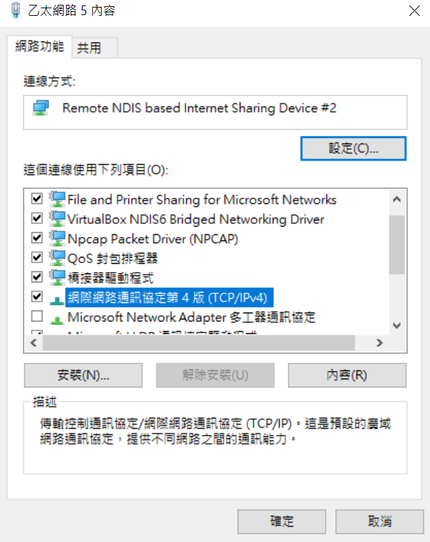
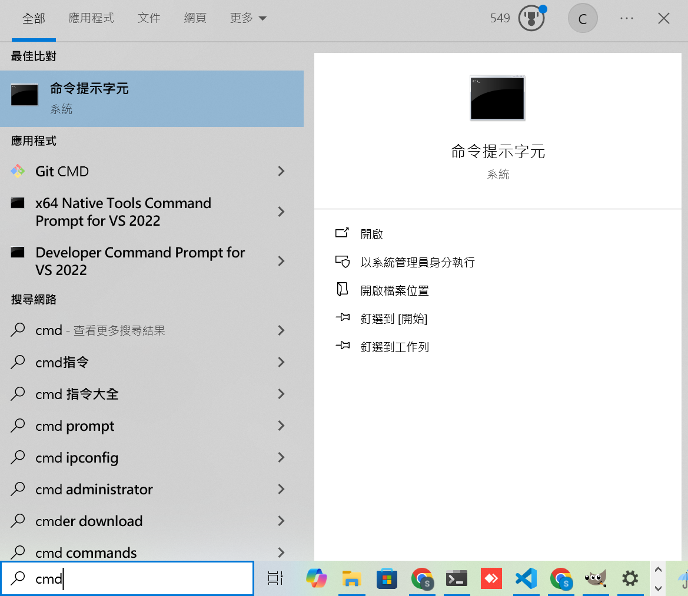
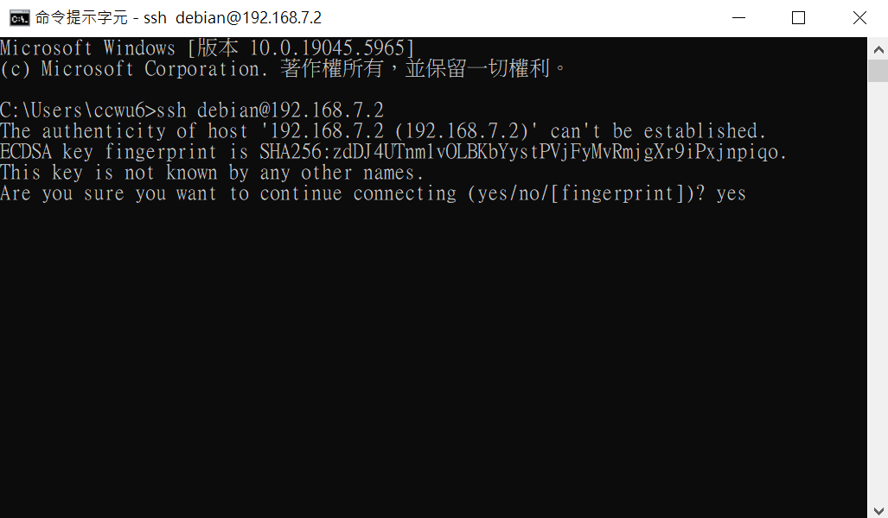
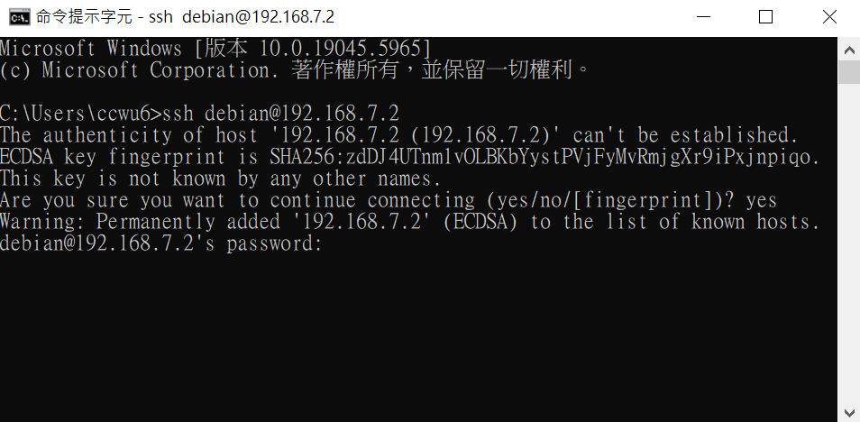
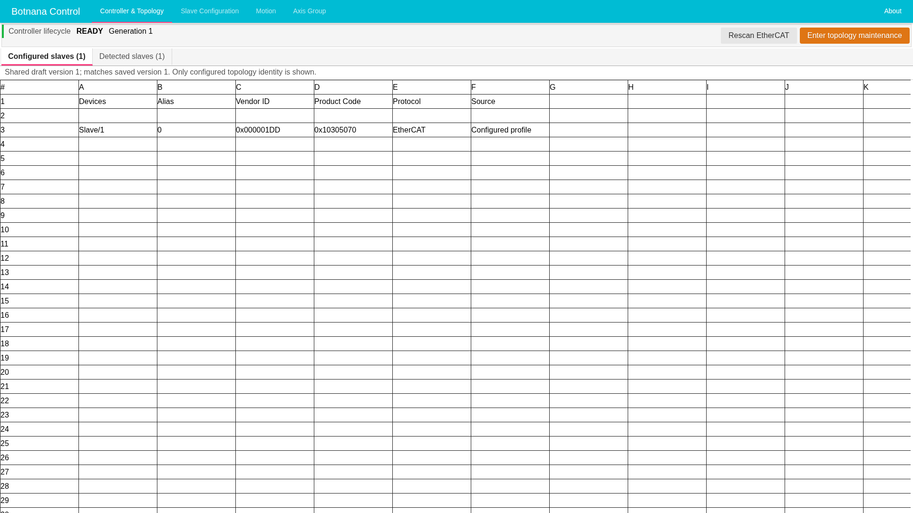
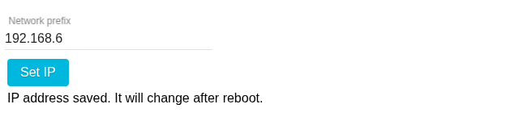
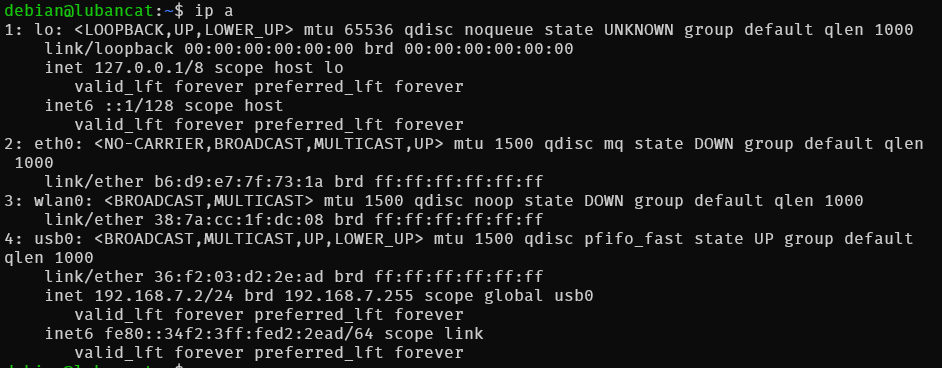

## USB 連線 IP 設定

新購買的 BN-B3A 的 IP 為 192.168.7.2。因此，建議上位控制器的 IP 設為 192.168.7.1。網路遮罩設為 255.255.255.0 ，如下所示。

1. 開啟設定／網路和網際網路, 選擇進階網路設定中的變更界面卡選項。

    

1. 選擇型別為 Remote NDS 或是 RNDIS 的無法辨識的乙太網路。

    

1. 選擇此一網路的內容。

    

1. 選擇網際網路通訊協定。

    

1. 設定 IP 地址和遮罩。

    

1. 連線測試，使用命令提示字元或是 Power shell，

    

1. 執行 ssh debian@192.168.7.2，debian 為登入帳號。當詢問是否繼續時，回答 yes。

    

1. 詢問密碼時，回答 temppwd。

    

1. 以下為登入內建的 Linux 系統的畫面。

    

1. 也可以使用瀏覽器連上 http://192.168.7.2:3000 來進行確認。目前 BN-B3A 尚未支援
HTTPS，因此以下網頁會出現紅色不安全警告，可以忽略此警告。

    

### 修改控制器 IP 位址

1. 讓機台進入安全停止狀態，然後選擇 **ABOUT**。
2. 等待 **Current IP address** 顯示已儲存的控制器位址。繼續之前，請同時記錄舊位址及預定的新位址。

   

3. 在 **Network prefix** 輸入新網路的前三個數字。控制器位址固定以 `.2` 結尾。例如，輸入 `192.168.6` 會儲存 `192.168.6.2`。
4. 確認預覽顯示的位址完全符合預期。

   

5. 選擇 **Set IP**，並等待畫面顯示 **IP address saved. It will change after reboot.**

   

6. 如果無法使用 **Set IP**，請等待系統選定設定通訊協定第 2 版並載入已儲存設定。再次嘗試前，必須儲存或捨棄尚未儲存的機台設定變更。
7. 選擇 **REBOOT**。重新開機前，已儲存的新位址不會生效。
8. 將上位電腦改設至新網路，例如 `192.168.6.1`，再使用新位址重新連線控制器，例如 `http://192.168.6.2:3000`。

### 同一電腦連接多塊 BN-B3A

修改方式如 **修改 IP** ，但每塊 BN-B3A 要設為不同的 IP 區段。

例如︰
第一塊設為 address 192.168.**6**.2，第二塊設為 address 192.168.**7**.2。

### 如果忘記了修改了的 IP ，該怎麼辦？

BN-B3A 有 HDMI 及 USB，接上螢幕及鍵盤，開機後可使用使用者名稱 debian 登入，密碼為 temppwd，登入後，執行 `ip a`。參考下圖，usb0 的 IP 就是設定的 IP，在圖中顯示的 IP 是 192.168.7.2 。

