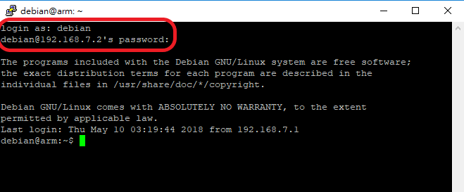

## USB連線IP設定

1. 開啟設定／網路和網際網路, 選擇進階網路設定中的變更界面卡選項。

    

1. 選擇型別為 Remote NDS 或是 RNDIS 的無法辨識的乙太網路。

    

1. 選擇此一網路的內容。

    

1. 選擇網際網路通訊協定。

    

1. 設定 IP 地址和遮罩。

    

1. 連線測試 (假設用 ssh 連線軟體)

    

1. username / password: debian / temppwd
    

### 同一電腦連接單一塊 Botnana

TODO

### 同一電腦連接多塊 Botnana  

修改方式如 **同一電腦連接單一塊 Botnana** ，最大的差異是︰**每塊Botnana要設為不同的區段**。

例如︰
第一塊設為 address 192.168.**6**.2，第二塊設為 address 192.168.**7**.2。