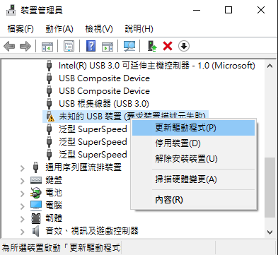
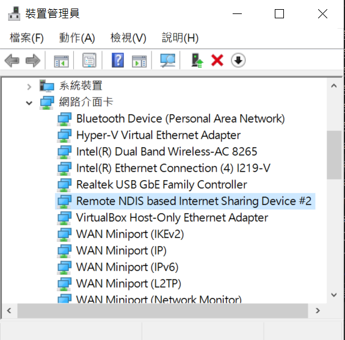
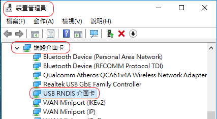
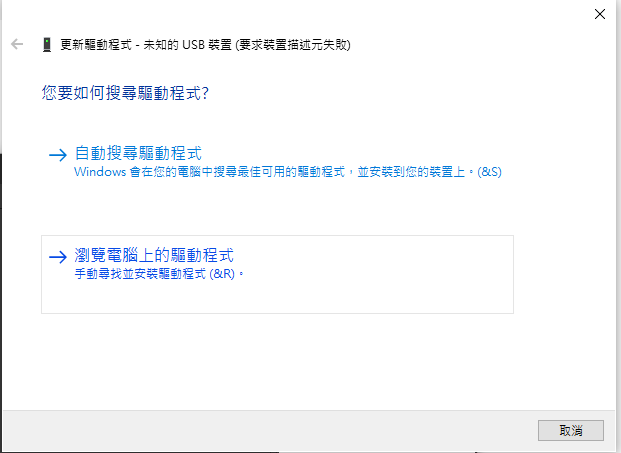
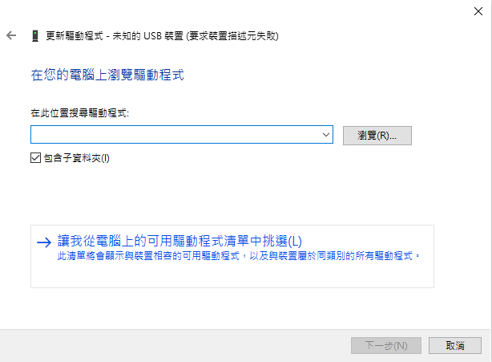
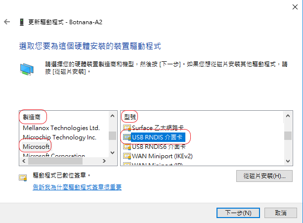
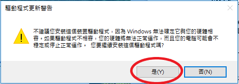

## WINDOWS 10 透過 Type-C USB 與 Botnana BN-B3A 連線時需先安裝 RNDIS 驅動程式

1. 將 Botnana BN-B3A Type-C USB 埠與電腦連接。

1. 如果看到的是以下未知裝置，請先解除安裝裝置，再重新安裝 RNDIS 驅動程式

    

1. 如果看到的是以下的 Remote NDS 或是 RNDIS 裝置，代表已安裝，或可選擇更新驅動程式。

    

    或是

    

1. 安裝驅動程式時，選瀏覽電腦上的驅動程式軟體

    

1. 選讓我從電腦上的可用驅動程式清單中挑選

    

1. 硬體類型選 網路介面卡

    

1. 製造商 / 型號︰Microsoft / USB RNDIS介面卡

    

1. 忽略警告訊息

    

1. 驅動程式更新成功

    

1. 檢查是否出現這個裝置︰裝置管理員/網路介面卡/USB RNDIS介面卡/Remote NDIS Device

    

    或是

    

