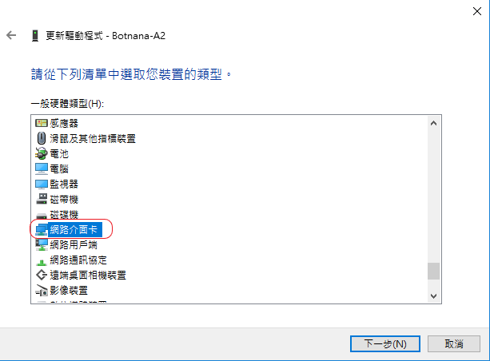

## WINDOWS 10 透過 Type-C USB 與 Botnana BN-B3A 連線時需先安裝 RNDIS 驅動程式

#### 0. 將 Botnana BN-B3A Type-C USB 埠與電腦連接。

註解︰若已嘗試過安裝 RNDIS 驅動程式，請從步驟 1 開始；否則，請直接從步驟 3 開始。

#### 4. 選裝置管理員中的 BN-B3A，並更新驅動程式

#### 5. 選 瀏覽電腦上的驅動程式軟體

#### 6. 選 讓我從電腦上的可用驅動程式清單中挑選

#### 7. 硬體類型選 網路介面卡

#### 8. 製造商 / 型號︰Microsoft / USB RNDIS介面卡

#### 9. 忽略警告訊息

#### 10. 驅動程式更新成功

#### 11. 檢查是否出現這個裝置︰裝置管理員/網路介面卡/USB RNDIS介面卡

#### 12. 連線測試（假設用 PuTTY 連線軟體）

#### 13. username / password: debian / temppwd

