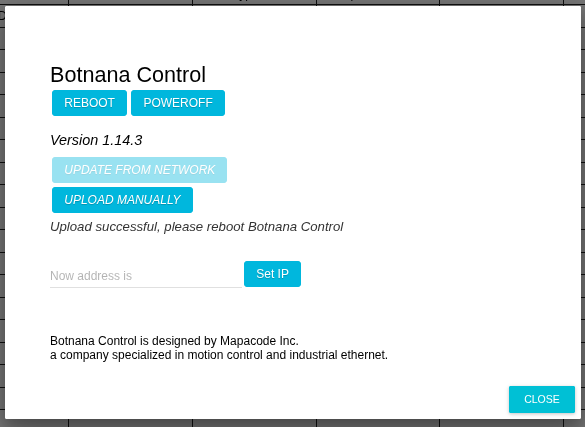
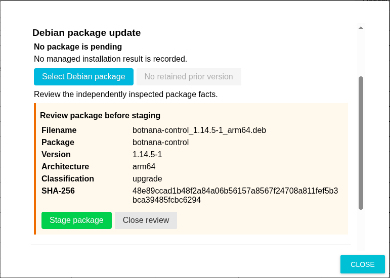
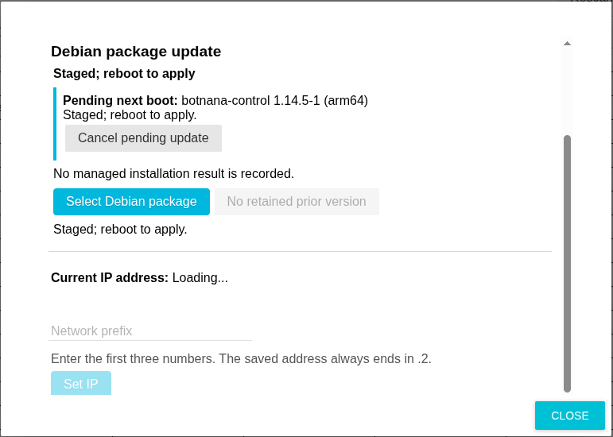
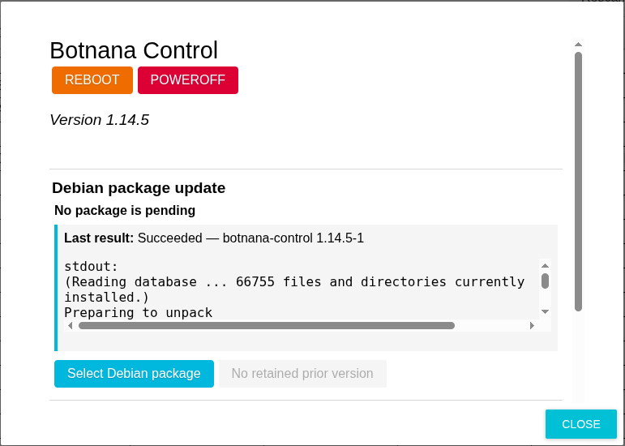
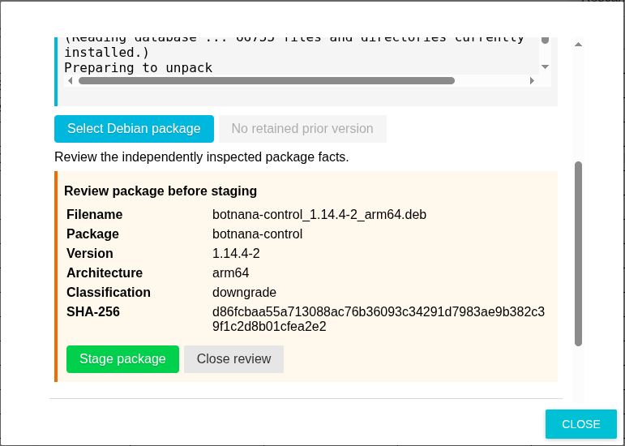
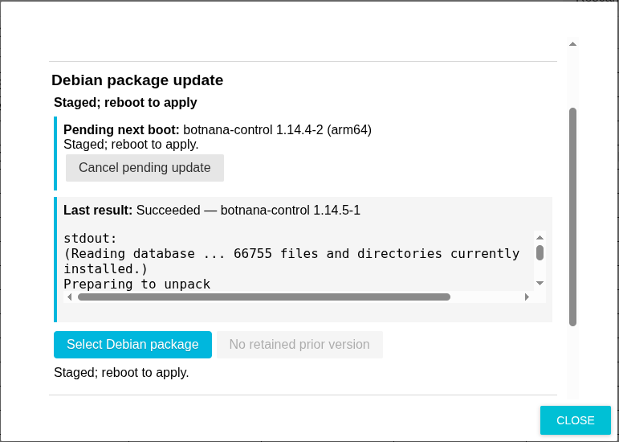
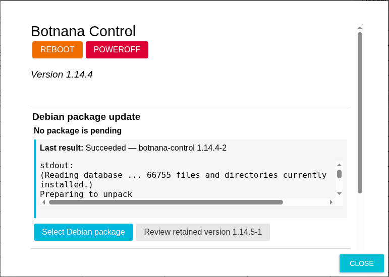

# 軟體更新

請依控制器目前顯示的 **ABOUT** 頁面選擇程序。Botnana Control 1.14.3 與更早版本使用舊版上傳頁面；1.14.4 與更新版本則使用經審查的 Debian 套件更新區域。

## 更新前準備

- 請向動程公司或其他可信任來源取得套件。不要安裝來源不明、未經確認的套件。
- 只可從可信任的控制網路執行更新。
- 依現場安全程序讓機台進入安全停止狀態。軟體更新與重新開機不是安全功能。
- 安裝套件期間請保持電源供應。
- 記錄目前的軟體版本及控制器 IP 位址。

BN-B3A 的套件檔名格式如下：

```text
botnana-control_<Debian-version>_arm64.deb
```

由舊版轉換至 1.14.4 時，請使用已修正的套件：

```text
botnana-control_1.14.4-2_arm64.deb
```

Debian 套件版本是 `1.14.4-2`；Botnana Control 畫面顯示的產品版本是 `1.14.4`。

## 從 1.14.3 或更早版本升級

這是從舊版更新程式轉換至 1.14.4 新套件更新程式的一次性程序。

1. 準備一部已設定好 Botnana Control 網路連線的電腦，建議使用 Google Chrome。
2. 開啟控制器 HMI；一般網址為 [http://192.168.7.2:3000](http://192.168.7.2:3000)，然後選擇 **ABOUT**。
3. 確認舊版 **ABOUT** 頁面顯示 1.14.3 或更早版本，且有 **UPLOAD MANUALLY** 按鈕。

   

4. 選擇 **UPLOAD MANUALLY**，再選取 `botnana-control_1.14.4-2_arm64.deb`。等待上傳完成；上傳期間不要關閉頁面或切斷電源。
5. 出現 **Upload successful, please reboot Botnana Control** 後，選擇 **REBOOT**。

   

6. BN-B3A 重新開機及安裝套件約需三分鐘。在此期間不要切斷電源。
7. 重新連線 HMI，開啟 **ABOUT**，確認畫面顯示 **Version 1.14.4**。

   

8. 重新載入瀏覽器頁面後，才讓機台恢復運轉。

完成這次舊版升級後，畫面可能顯示 **No managed installation result is recorded** 及 **No retained prior version**。這是正常現象：安裝是由舊版更新程式執行，當時 1.14.4 的套件管理程式尚未啟用。這些訊息不表示安裝失敗。

## 更新 1.14.4 或更新版本

1.14.4 與更新版本使用 **ABOUT** 頁面的 **Debian package update** 區域。以下範例使用 Debian 套件 `botnana-control_1.14.5-1_arm64.deb` 更新產品版本 1.14.4。

1. 讓機台進入安全停止狀態，然後開啟 **ABOUT**。
2. 選擇 **Select Debian package**，再選取供應的 `.deb` 檔案。
3. 確認後續畫面顯示的所有資料：
   - 原始檔名；
   - 套件識別名稱（`botnana-control`）；
   - Debian 版本；
   - 架構（BN-B3A 應為 `arm64`）；
   - upgrade、reinstall 或 downgrade 等分類；
   - SHA-256 檢查碼。

   

4. 所有資料都符合預定版本時，才選擇 **Stage package**。暫存成功後，控制器會在下次開機時對已審查的確切套件執行一次安裝。
5. 確認畫面顯示 **Staged; reboot to apply**，然後選擇 **REBOOT**。不要以關機代替此次安裝所需的重新開機。

   

6. 等待控制器重新啟動，重新連線並開啟 **ABOUT**。
7. 同時確認畫面上的產品版本及 **Last result**。

   

| Last result | 意義與處理方式 |
|---|---|
| **Succeeded** | 已安裝管理的套件。操作機台前，請確認畫面顯示的版本。 |
| **Rejected before installation** | 套件未通過重新驗證，因此沒有安裝。請取得並審查正確套件。 |
| **Installation failed**、**Timed out** 或 **Interrupted** | 安裝可能不完整。不要操作運動控制；請暫存已審查且確認正常的 Botnana Control 套件，再重新開機復原。 |
| **Bookkeeping failed** 或 **Unknown result** | 無法信任安裝是否完整。保持機台停止，並依相同程序復原。 |

安裝開始前可以取消 pending 套件。開機安裝一旦開始，就只會嘗試一次，不能取消，也不會自動重試。

## 保留套件與降版

頁面可能提供 **Review retained version**。這是先前由新套件管理程式成功安裝後所保留的完整套件，不一定是目前版本之前實際安裝的軟體；例如，曾透過舊版更新程式或 Linux 指令變更套件時，兩者可能不同。

若有保留套件，請選擇 **Review retained version**，確認其資訊及檢查碼，再暫存並重新開機。

如果畫面顯示 **No retained prior version**，請向動程公司取得所需且確認正常的套件；控制器無法從已安裝的檔案重建遺失的 `.deb`。以下範例在 1.14.5 運行時選取 `botnana-control_1.14.4-2_arm64.deb`。暫存前必須確認分類是 **downgrade**。



完成審查後，暫存該套件並重新開機。



重新啟動後，確認產品版本為 1.14.4，且結果顯示成功安裝 `1.14.4-2`。因為 1.14.5 是由新套件管理程式安裝，其完整套件現在可透過 **Review retained version 1.14.5-1** 使用。



## 畫面版本不符合預期時

保持機台停止。重新載入 **ABOUT**，並比較產品版本與 **Last result**。若完成一次性舊版升級後沒有安裝結果，請確認產品版本是否已變更為預定版本。若更新結果顯示失敗或版本仍是舊版，請暫存已審查且確認正常的套件後再重新開機；不要在沒有 pending 復原套件時反覆重新開機。
